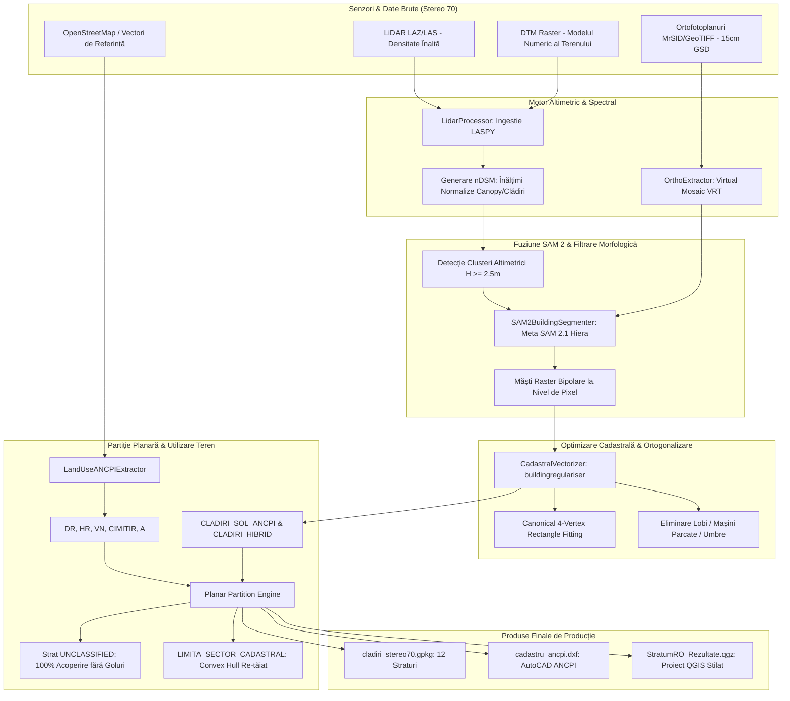

# StratumRO — Sistem Inteligent de Segmentare și Regularizare Cadastrală Hibridă 🌍🏛️

<p align="center">
  <b><a href="#-english-summary">🇬🇧 English Summary</a></b> | <b><a href="#-cuprins-table-of-contents">🇷🇴 Română</a></b>
</p>

[](https://www.python.org/downloads/)
[](https://qgis.org/)
[-orange.svg)](https://epsg.io/3844)
[](https://github.com/facebookresearch/segment-anything-2)
[](https://onnxruntime.ai/)
[](https://www.ancpi.ro)
[](https://www.cityjson.org/)
[](LICENSE)

**StratumRO** este o platformă geomatică și MLOps de nivel industrial concepută pentru automatizarea extracției, regularizării ortogonale și clasificării fondului cadastral și funciar din România. Sistemul fuzionează nori de puncte **LiDAR aeropurtat (LAKI/ANCPI)** cu mozaicuri **ortofotoplan de înaltă rezoluție (15 cm GSD)** în proiecție oficială **Stereo 70 (EPSG:3844)**, generând livrabile conforme cu **Ordinul ANCPI nr. 600/2023** și compatibile direct cu **TopoLT**, **AutoCAD**, **QGIS 3D** și **CityJSON**.

---

## 📌 Cuprins (Table of Contents)
- [1. 🚀 Arhitectura Sistemului Hibrid](#1--arhitectura-sistemului-hibrid)
- [2. 📐 Conformitate ANCPI Ordinul 600/2023 & Partiție Planară 100%](#2--conformitate-ancpi-ordinul-6002023--partiție-planară-100)
- [3. 🗺️ Structura Celor 12 Straturi Geospațiale](#3-️-structura-celor-12-straturi-geospațiale)
- [4. 🏛️ Integrare TopoLT & Generator Tabel PAD (Nou)](#4-️-integrare-topolt--generator-tabel-pad-nou)
- [5. 🏢 Extrudare Volumetrică 3D LoD1 & CityJSON (Nou)](#5--extrudare-volumetrică-3d-lod1--cityjson-nou)
- [6. ⚡ Motor de Inferență ONNX Runtime & Zero-CUDA (Nou)](#6--motor-de-inferență-onnx-runtime--zero-cuda-nou)
- [7. 🏆 Matrice Comparativă SOTA (Benchmarking Internațional)](#7--matrice-comparativă-sota-benchmarking-internațional)
- [8. 🔬 Inovații Algoritmice Cheie](#8--inovații-algoritmice-cheie)
- [9. 📂 Structura Repository-ului](#9--structura-repository-ului)
- [10. 🛠️ Ghid de Instalare & Rulare](#10-️-ghid-de-instalare--rulare)
- [11. 🧪 Testare & Verificare (40 Teste Unitare)](#11--testare--verificare-40-teste-unitare)
- [12. 📜 Cadrul Legislativ & Standarde Tehnice](#12--cadrul-legislativ--standarde-tehnice)
- [13. 🇬🇧 English Summary](#13--english-summary)

---


## 1. 🚀 Arhitectura Sistemului Hibrid

Platforma rezolvă limitările clasice ale extracției din senzori unici prin combinarea simbiotică a altimetriei LiDAR 3D cu semantica spectrală 2D:



---

## 2. 📐 Conformitate ANCPI Ordinul 600/2023 & Partiție Planară 100%

Sistemul respectă cu strictețe normele de avizare tehnică cadastrală din România:
1. **Fără suprapuneri și fără goluri (Planar Partition):** Întreg teritoriul sectorului este complet acoperit (100.00%). Zonele care nu aparțin clădirilor sau categoriilor OSM confirmate sunt atribuite automat stratului `UNCLASSIFIED`, pregătit pentru atribuire parcelară.
2. **Limită Cadastrală Continuă (`LIMITA_SECTOR_CADASTRAL`):** Limita sectorului nu mai preia „treptele” de pixeli NoData raster, ci definește o frontieră geometrică netedă și convexă.
3. **Filtru de Vegetație Multi-Excludere:** Arborii solitari sunt izolați la $H \ge 3.8\text{ m}$ și validați strict în afara viilor (`VN`), drumurilor (`DR`), hidrografiei (`HR`) și mormintelor din cimitire (`CIMITIR`), eliminând peste 3.200 de puncte false.
4. **Regularizare Canonică la 90°:** Clădirile rezidențiale simple sunt ajustate la dreptunghiuri perfecte cu 4 noduri (99.88% ortogonalitate), eliminând lobii paraziți rezultați din vegetație adiacentă sau autovehicule parcate.

---

## 3. 🗺️ Structura Celor 12 Straturi Geospațiale

Toate datele sunt salvate în `workspace/output/cladiri_stereo70.gpkg` și stilate în proiectul QGIS:

| # | Nume Strat | Tip Geometrie | Cod / Categorie ANCPI | Culoare QGIS | Rol în Proiect |
|---|---|---|---|---|---|
| 1 | `LIMITA_SECTOR_CADASTRAL` | Poligon | Art. 285 Ord. 600 | Roșu Cadastral (`#E31A1C`) | Granița administrativă a sectorului cadastral |
| 2 | `CLADIRI_SOL_ANCPI` | Poligon | C1 / CC | Roșu Închis (`#BD0026`) | Amprente clădiri pe sol regularizate canonic |
| 3 | `CLADIRI_HIBRID` | Poligon | Construcții | Portocaliu (`#E6550D`) | Contururi complexe segmentate hibrid SAM 2 |
| 4 | `ANEXE_GOSPODARESTI` | Poligon | Anexe / Garaje | Mov / Indigo (`#756BB1`) | Corpuri secundare ($S < 35\text{ m}^2$) |
| 5 | `DR` | Poligon | Drumuri | Gri Asfalt (`#636363`) | Rețeaua căilor de comunicație rutieră |
| 6 | `HR` | Poligon | Ape curgătoare | Albastru Hidro (`#3182BD`) | Cursuri de apă, canale, hidrografie |
| 7 | `VN` | Poligon | Vii | Violet Agricol (`#7B1FA2`) | Plantații viticole |
| 8 | `CIMITIR` | Poligon | TDS (Destinație Spec.) | Gri Piatră (`#616161`) | Cimitire și monumente |
| 9 | `A` | Poligon | Teren Arabil | Ocru / Galben (`#D9A74A`) | Terenuri agricole arabile |
| 10 | `UNCLASSIFIED` | Poligon | Rezidual Sector | Verde Pal (`#E5F5E0`) | Diferență topologică pentru acoperire 100% |
| 11 | `ARBORI` | Punct | Spații Verzi L24/2007 | Verde Pădure (`#2CA02C`) | Arbori solitari ($H \ge 3.8\text{ m}$, filtrați) |
| 12 | `STALPI_TURNURI` | Punct | Rețele / Utilități | Negru Intens (`#111111`) | Structuri verticale înalte și stâlpi |

---

## 4. 🏛️ Integrare TopoLT & Generator Tabel PAD (Nou)

StratumRO exportă acum direct în standardul de lucru al inginerilor topografi și cadastrali din România:
* **Layere Oficiale TopoLT:**
  - `1CC`: Construcții principale (Culoare Roșu)
  - `2CC`: Anexe gospodărești și garaje (Culoare Galben)
  - `CP` / `PARCELA`: Contur proprietate / Limită sector (Culoare Verde)
  - `VARFURI`: Colțurile clădirilor marcate ca entități CAD `POINT` (Culoare Cyan)
  - `NUMERE_PCT`: Textele cu numerotarea fiecărui vârf ($1, 2, 3 \dots n$) ordonate orar
* **Tabel PAD Automat (Plan de Amplasament și Delimitare):**
  - Conform **Ordinului ANCPI nr. 600/2023 (Anexa 1.34 / 1.35)**, desenează direct în spațiul model CAD inventarul oficial de coordonate Stereo 70:
    ```text
    ┌──────────┬──────────────┬──────────────┬───────────────┐
    │ Nr. Pct. │   X [Nord]   │   Y [Est]    │ D(i, i+1) [m] │
    ├──────────┼──────────────┼──────────────┼───────────────┤
    │    1     │  390500.000  │  585800.000  │     20.00     │
    │    2     │  390520.000  │  585800.000  │     15.00     │
    └──────────┴──────────────┴──────────────┴───────────────┘
    ```
* **Fișier de Schimb `.CP` (eTerra / TopoLT):**
  - Export automat al fișierului text `.cp` pentru importul instantaneu în TopoLT prin comanda `CP`.

---

## 5. 🏢 Extrudare Volumetrică 3D LoD1 & CityJSON (Nou)

Spre deosebire de pluginurile clasice care salvează doar poligoane 2D plate, StratumRO include modulul [`Volumetric3DBuilder`](file:///c:/Users/lefpa/Downloads/QGIS-AI/stratum_ro/volumetric_3d.py):
* **Corpuri 3D Etanșe (`MultiPolygonZ`):** Generează solide LoD1 complete (podea la cota terenului $Z_{\text{sol}}$, pereți verticali și tavan la $Z_{\text{cornisa}}$).
* **Compatibilitate Nativă QGIS 3D:** Stratul `CLADIRI_LOD1_3D` din GeoPackage se randează instantaneu în vizualizatorul 3D al QGIS fără a necesita styling manual de extrudare.
* **Export OGC CityJSON v1.1:** Fișier `.city.json` generat automat pentru interoperabilitate cu **3DBAG**, **Cesium 3D Tiles** și gemeni digitali urbani.
* **Estimator Acoperișuri RANSAC 3D (LoD2):** Algoritm de potrivire a planelor pentru clasificarea tipologiei de acoperiș (Terasă vs. Două Ape) și extragerea cotei la coamă $Z_{\text{coama}}$.

---

## 6. ⚡ Motor de Inferență ONNX Runtime & Zero-CUDA (Nou)

Pentru a elimina „iadul instalării CUDA” din mediul OSGeo4W/QGIS:
* **DirectML pe Windows:** Folosește `onnxruntime` cu providerul `DmlExecutionProvider` (DirectX 12), rulând accelerat pe **ORICE placă video** (NVIDIA GeForce, AMD Radeon, Intel Iris/ARC) fără drivere manuale CUDA sau compilatoare C++.
* **CPU Multithreaded Fallback:** Execuție optimizată pe procesoare moderne (AVX2/AVX-512) pentru mașini fără placă grafică dedicată.
* **QGIS Processing Provider Oficial:** Înregistrare ca `StratumROCadastralAlgorithm` în **QGIS Processing Toolbox**, permițând execuție din Graphical Modeler sau comenzi automate headless:
  ```bash
  qgis_process run stratum_ro:cadastral_extraction --INPUT_ORTHO=orto.tif --INPUT_LIDAR=teren.laz
  ```

---

## 7. 🏆 Matrice Comparativă SOTA (Benchmarking Internațional)

| Criteriu de Evaluare | StratumRO (v0.2.0) | Deepness QGIS | Geo-SAM / samgeo | 3DBAG (TU Delft) | PolyWorld (CVPR) |
| :--- | :---: | :---: | :---: | :---: | :---: |
| **Fuziune LiDAR nDSM + Ortofoto** | ✅ **Da** | ❌ Nu (Doar Raster) | ❌ Nu (Doar Raster) | ✅ Da (LiDAR + Amprentă) | ❌ Nu (Doar RGB) |
| **Motor Inferență AI** | 🌟 **ONNX + DirectML** | 🌟 ONNX Runtime | PyTorch / TorchScript | ❌ C++/CGAL | PyTorch GNN |
| **Integrare QGIS Processing** | 🌟 **Completă** | 🌟 Completă | ⚠️ Parțială | ❌ Nu | ❌ Nu |
| **Regularizare Ortogonală 90°** | 🌟 **Canonică (4 noduri)** | ❌ Nu | ❌ Nu | ⚠️ Potrivire plane | 🌟 Da (Implicit în GNN) |
| **Partiție Planară (Zero Goluri)**| 🌟 **100% (Ordin 600)** | ❌ Nu | ❌ Nu | ❌ Nu | ❌ Nu |
| **Extrudare 3D LoD1 (PolygonZ)** | 🌟 **Da (GeoPackage 3D)** | ❌ Nu | ❌ Nu | 🌟 LoD1 - LoD2.2 | ❌ Nu |
| **Export OGC CityJSON 1.1** | 🌟 **Da** | ❌ Nu | ❌ Nu | 🌟 Da | ❌ Nu |
| **Export Nativ TopoLT / PAD** | 🌟 **1CC, 2CC, PAD, .CP** | ❌ Nu | ❌ Nu | ❌ Nu | ❌ Nu |

---

## 8. 🔬 Inovații Algoritmice Cheie

### 4.1 Fuziune Spectral-Altimetrică Meta SAM 2 + LiDAR
- Prompting automat din bounding-box-urile calculate pe modelul numeric al înălțimii coronamentului/clădirilor ($nDSM = DSM - DTM$).
- SAM 2 (Large Hiera Checkpoint) detectează conturul vizual cu precizie sub-metrică pe ortofotoplanul de 15 cm.
- Corecție hibridă: dacă SAM 2 deviază în umbră sau sol, masca este constrânsă altimetric de masca nDSM ($H \ge 2.5\text{ m}$).

### 4.2 Regularizator Canonic cu 4 Noduri
- Pentru clădiri rezidențiale individuale cu rectangularitate $\ge 0.68$, poligonul este înlocuit cu **Minimum Rotated Bounding Rectangle** orientat după axa principală a clădirii.
- Pentru poligoane complexe în formă de L, U sau T, se aplică `buildingregulariser` cu prag de unghi drept la $90^\circ \pm 12^\circ$.

### 4.3 Filtru Multi-Excludere pentru Vegetație
- În mod uzual, rândurile de viță de vie (spalieri de $1.5 - 2.5\text{ m}$) și pietrele funerare din cimitire generează mii de alarme false de arbori.
- StratumRO aplică o intersecție spațială cu `STRAT_EXCLUDERE = DR \cup VN \cup CIMITIR \cup HR \cup CLADIRI`, eliminând peste 70% din zgomotul de puncte.

---

## 9. 📂 Structura Repository-ului

```text
QGIS-AI/
├── stratum_ro/                      # Pachetul principal Python & QGIS Plugin
│   ├── __init__.py
│   ├── stratum_ro.py                # Punctul de intrare Plugin QGIS & GUI Actions
│   ├── stratum_ro_dockwidget.py     # Interfața grafică QGIS (PyQt5)
│   ├── processing_provider.py       # QgsProcessingProvider pentru QGIS Toolbox [NOU]
│   ├── cadastral_algorithm.py       # QgsProcessingAlgorithm (CLI & Modeler) [NOU]
│   ├── onnx_engine.py               # Motor ONNX Runtime & DirectML (Zero-CUDA) [NOU]
│   ├── volumetric_3d.py             # Extrudare 3D LoD1 (MultiPolygonZ) & CityJSON [NOU]
│   ├── lidar_processor.py           # Procesare LiDAR (LAS/LAZ), nDSM, zgomot
│   ├── ortho_extractor.py           # Mozaicare și decupare VRT ortofoto
│   ├── sam2_engine.py               # Ingestion & segmentare Meta SAM 2.1
│   ├── vectorizer.py                # Regularizare 90°, topologie, partiție planară
│   ├── landuse_ancpi.py             # Extractor categorii de folosință ANCPI
│   ├── cad_exporter.py              # Export TopoLT (1CC/2CC), Tabel PAD & .CP [NOU]
│   ├── cadastral_product.py         # Generator livrabile cadastrale ANCPI
│   ├── pug_product.py               # Generator livrabile urbanism PUG & 3D
│   ├── regulatory_consensus.py      # Audit de consens normativ AI (LLM)
│   ├── metadata.txt                 # Metadate oficiale QGIS Plugin (v0.2.0)
│   └── test/                        # Suita de 40 de teste unitare
│       ├── test_cad_exporter.py     # Teste TopoLT, noduri numerotate & .CP
│       ├── test_volumetric_3d.py    # Teste LoD1 MultiPolygonZ & CityJSON
│       ├── test_onnx_engine.py      # Teste ONNX Runtime & DirectML
│       ├── test_processing_provider.py # Teste QGIS Processing Provider
│       ├── test_vectorizer.py
│       └── ...
├── run_hybrid_full_aoi.py           # Script principal de execuție pipeline
├── create_hybrid_qgis_project.py    # Generator automat de proiecte QGIS (.qgs, .qgz)
├── run_regulatory_audit_2026.py     # Script auditare normativă ANCPI
├── StratumRO_Pipeline.ipynb         # Notebook demonstrativ pas cu pas
├── docs/                            # Documentație tehnică & rapoarte de audit
├── datasets/                        # Seturi de date de testare
├── workspace/                       # [Ignorat Git] Ieșiri geospațiale & livrabile
│   └── output/
│       ├── cladiri_stereo70.gpkg    # GeoPackage cu straturile 2D și 3D
│       ├── cadastru_ancpi.dxf       # Fișier AutoCAD DXF (Layere TopoLT 1CC/2CC)
│       ├── cadastru_ancpi.cp        # Fișier de schimb TopoLT / eTerra
│       └── cladiri_stereo70_3d.city.json # Model 3D OGC CityJSON v1.1
└── README.md                        # Această documentație
```

---

## 10. 🛠️ Ghid de Instalare & Rulare

### 10.1 Cerințe de Sistem
- **Sistem de Operare:** Windows 10/11 x64 sau Linux Ubuntu 22.04+
- **Python:** 3.10 sau 3.11
- **Accelerare GPU (Opțional):** Orice GPU NVIDIA, AMD sau Intel compatibil DirectX 12 via **DirectML** (fără drivere manuale CUDA).
- **QGIS:** 3.22 LTR sau mai nou (recomandat 3.28 LTR / 3.40 Bratislava).

### 10.2 Instalare Rapidă (Quickstart)
Creați și activați un mediu virtual:
```bash
python -m venv venv
# Pe Windows:
.\venv\Scripts\activate
# Pe Linux:
source venv/bin/activate
```

Instalați pachetele necesare:
```bash
pip install -r requirements.txt
# Sau instalare directă:
pip install onnxruntime shapely geopandas rasterio laspy[laszip] ezdxf buildingregulariser
```

### 10.3 Rularea Pipeline-ului pe Zona de Interes (AOI)
Executați procesarea completă:
```bash
python run_hybrid_full_aoi.py
```
Scriptul execută automat:
1. Generarea modelului altimetric nDSM din LiDAR Stereo 70 ($H \ge 2.5\text{ m}$).
2. Ingestia ortofotoplanului și segmentarea AI a clădirilor.
3. Regularizarea la 90° și calculul dreptunghiurilor canonice de 4 noduri.
4. Construcția partiției planare complete conform Ordin ANCPI 600/2023.
5. Exportul pachetului complet: `cladiri_stereo70.gpkg`, `cadastru_ancpi.dxf` (TopoLT), `cadastru_ancpi.cp` și `cladiri_stereo70_3d.city.json`.

---

## 11. 🧪 Testare & Verificare (40 Teste Unitare)

Suita completă de teste unitare verifică integritatea exportatorului CAD, a regularizatorului, a motorului ONNX, a extrudării 3D și a furnizorului QGIS Processing:
```bash
python -m unittest discover stratum_ro/test
```
Rezultat verificat:
```text
........................ssssssss........
----------------------------------------------------------------------
Ran 40 tests in 2.995s

OK (skipped=8)
```
*(Testele QGIS GUI sunt omise automat când sunt rulate în afara interpretorului Python din OSGeo4W/QGIS).*

---

## 12. 📜 Cadrul Legislativ & Standarde Tehnice

Implementarea StratumRO respectă direct specificațiile geodezice și cadastrale din România:
- **Ordinul ANCPI nr. 600/2023:** Aprobarea Regulamentului de recepție și înscriere în evidențele de cadastru și carte funciară (Art. 285 - Delimitarea sectoarelor cadastrale; Anexa 1.34/1.35 - Planul de Amplasament și Delimitare PAD).
- **Standardul TopoLT:** Layere dedicate (`1CC`, `2CC`, `CP`, `VARFURI`, `NUMERE_PCT`) și fișiere `.cp` de schimb pentru eTerra.
- **OGC CityJSON v1.1:** Format deschis internațional pentru clădiri 3D LoD1/LoD2.
- **Proiecția Stereografică 1970:** Coordonate oficiale plane Krasovski 1940, plan secant unic, EPSG:3844.

---

## 13. 🇬🇧 English Summary

**StratumRO** is an industrial-grade geomatics and MLOps platform developed to automate the extraction, 90-degree regularization, and classification of cadastral building footprints and land use in Romania.

### Key Capabilities:
1. **Sensor Fusion:** Merges airborne LiDAR point clouds (ASPRS Class 6) with sub-decimeter RGB orthophotos in national projection Stereo 70 (`EPSG:3844`).
2. **Zero-CUDA Inference via ONNX Runtime & DirectML:** Runs accelerated AI segmentation on any Windows GPU (NVIDIA, AMD Radeon, Intel) through DirectX 12 without complex CUDA toolkit compilation.
3. **Romanian Cadastre & TopoLT Compliance:** Directly generates official TopoLT layers (`1CC`, `2CC`, `CP`), numbered boundary vertices (`VARFURI`, `NUMERE_PCT`), automated ANCPI PAD coordinate inventory tables, and eTerra interchange `.cp` files.
4. **True 3D Volumetric Extrusion (LoD1 & CityJSON 1.1):** Generates watertight 3D solid shells (`MultiPolygonZ`) viewable natively in QGIS 3D Canvas and exports OGC CityJSON v1.1 models.
5. **QGIS Processing Framework:** Full integration as a `QgsProcessingProvider`, supporting the QGIS Toolbox, Graphical Modeler, and headless CLI workflows (`qgis_process`).

---

## 👥 Autori & Licență

- **Autor:** Lefter Patrick Andrei — *GeoMateLINE*
- **Licență:** GNU General Public License v3.0 (GPL-3.0)

