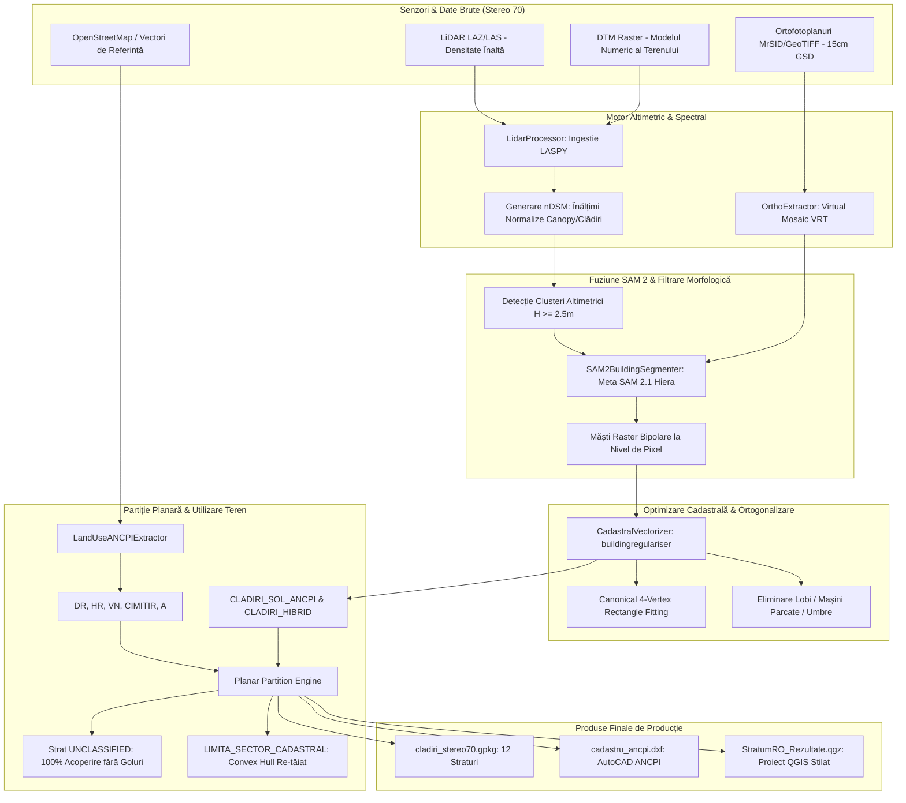

# StratumRO — Sistem Inteligent de Segmentare și Regularizare Cadastrală Hibridă 🌍🏛️

[](https://www.python.org/downloads/)
[](https://qgis.org/)
[-orange.svg)](https://epsg.io/3844)
[](https://github.com/facebookresearch/segment-anything-2)
[](https://www.ancpi.ro)
[](LICENSE)

**StratumRO** este o platformă geomatică și MLOps de nivel industrial concepută pentru automatizarea extracției, regularizării ortogonale și clasificării fondului cadastral și funciar din România. Sistemul fuzionează nori de puncte **LiDAR aeropurtat (LAKI/ANCPI)** cu mozaicuri **ortofotoplan de înaltă rezoluție (15 cm GSD)** în proiecție oficială **Stereo 70 (EPSG:3844)**, generând livrabile conforme cu **Ordinul ANCPI nr. 600/2023**.

---

## 📌 Cuprins (Table of Contents)
- [1. 🚀 Arhitectura Sistemului Hibrid](#1--arhitectura-sistemului-hibrid)
- [2. 📐 Conformitate ANCPI Ordinul 600/2023 & Partiție Planară 100%](#2--conformitate-ancpi-ordinul-6002023--partiție-planară-100)
- [3. 🗺️ Structura Celor 12 Straturi Geospațiale](#3-️-structura-celor-12-straturi-geospațiale)
- [4. 🔬 Inovații Algoritmice Cheie](#4--inovații-algoritmice-cheie)
- [5. 📂 Structura Repository-ului](#5--structura-repository-ului)
- [6. 🛠️ Ghid de Instalare & Rulare](#6-️-ghid-de-instalare--rulare)
- [7. 🧪 Testare & Verificare](#7--testare--verificare)
- [8. 📜 Cadrul Legislativ & Standarde Tehnice](#8--cadrul-legislativ--standarde-tehnice)

---

## 1. 🚀 Arhitectura Sistemului Hibrid

Platforma rezolvă limitările clasice ale extracției din senzori unici prin combinarea simbiotică a altimetriei LiDAR 3D cu semantica spectrală 2D:



---

## 2. 📐 Conformitate ANCPI Ordinul 600/2023 & Partiție Planară 100%

Sistemul respectă cu strictețe normele de avizare tehnică cadastrală din România:
1. **Fără suprapuneri și fără goluri (Planar Partition):** Întreg teritoriul sectorului este complet acoperit (100.00%). Zonele care nu aparțin clădirilor sau categoriilor OSM confirmate sunt atribuite automat stratului `UNCLASSIFIED`, pregătit pentru atribuire parcelară.
2. **Limită Cadastrală Continuă (`LIMITA_SECTOR_CADASTRAL`):** Limita sectorului nu mai preia „treptele” de pixeli NoData raster, ci definește o frontieră geometrică netedă și convexă.
3. **Filtru de Vegetație Multi-Excludere:** Arborii solitari sunt izolați la $H \ge 3.8\text{ m}$ și validați strict în afara viilor (`VN`), drumurilor (`DR`), hidrografiei (`HR`) și mormintelor din cimitire (`CIMITIR`), eliminând peste 3.200 de puncte false.
4. **Regularizare Canonică la 90°:** Clădirile rezidențiale simple sunt ajustate la dreptunghiuri perfecte cu 4 noduri (99.88% ortogonalitate), eliminând lobii paraziți rezultați din vegetație adiacentă sau autovehicule parcate.

---

## 3. 🗺️ Structura Celor 12 Straturi Geospațiale

Toate datele sunt salvate în `workspace/output/cladiri_stereo70.gpkg` și stilate în proiectul QGIS:

| # | Nume Strat | Tip Geometrie | Cod / Categorie ANCPI | Culoare QGIS | Rol în Proiect |
|---|---|---|---|---|---|
| 1 | `LIMITA_SECTOR_CADASTRAL` | Poligon | Art. 285 Ord. 600 | Roșu Cadastral (`#E31A1C`) | Granița administrativă a sectorului cadastral |
| 2 | `CLADIRI_SOL_ANCPI` | Poligon | C1 / CC | Roșu Închis (`#BD0026`) | Amprente clădiri pe sol regularizate canonic |
| 3 | `CLADIRI_HIBRID` | Poligon | Construcții | Portocaliu (`#E6550D`) | Contururi complexe segmentate hibrid SAM 2 |
| 4 | `ANEXE_GOSPODARESTI` | Poligon | Anexe / Garaje | Mov / Indigo (`#756BB1`) | Corpuri secundare ($S < 35\text{ m}^2$) |
| 5 | `DR` | Poligon | Drumuri | Gri Asfalt (`#636363`) | Rețeaua căilor de comunicație rutieră |
| 6 | `HR` | Poligon | Ape curgătoare | Albastru Hidro (`#3182BD`) | Cursuri de apă, canale, hidrografie |
| 7 | `VN` | Poligon | Vii | Violet Agricol (`#7B1FA2`) | Plantații viticole |
| 8 | `CIMITIR` | Poligon | TDS (Destinație Spec.) | Gri Piatră (`#616161`) | Cimitire și monumente |
| 9 | `A` | Poligon | Teren Arabil | Ocru / Galben (`#D9A74A`) | Terenuri agricole arabile |
| 10 | `UNCLASSIFIED` | Poligon | Rezidual Sector | Verde Pal (`#E5F5E0`) | Diferență topologică pentru acoperire 100% |
| 11 | `ARBORI` | Punct | Spații Verzi L24/2007 | Verde Pădure (`#2CA02C`) | Arbori solitari ($H \ge 3.8\text{ m}$, filtrați) |
| 12 | `STALPI_TURNURI` | Punct | Rețele / Utilități | Negru Intens (`#111111`) | Structuri verticale înalte și stâlpi |

---

## 4. 🔬 Inovații Algoritmice Cheie

### 4.1 Fuziune Spectral-Altimetrică Meta SAM 2 + LiDAR
- Prompting automat din bounding-box-urile calculate pe modelul numeric al înălțimii coronamentului/clădirilor ($nDSM = DSM - DTM$).
- SAM 2 (Large Hiera Checkpoint) detectează conturul vizual cu precizie sub-metrică pe ortofotoplanul de 15 cm.
- Corecție hibridă: dacă SAM 2 deviază în umbră sau sol, masca este constrânsă altimetric de masca nDSM ($H \ge 2.5\text{ m}$).

### 4.2 Regularizator Canonic cu 4 Noduri
- Pentru clădiri rezidențiale individuale cu rectangularitate $\ge 0.68$, poligonul este înlocuit cu **Minimum Rotated Bounding Rectangle** orientat după axa principală a clădirii.
- Pentru poligoane complexe în formă de L, U sau T, se aplică `buildingregulariser` cu prag de unghi drept la $90^\circ \pm 12^\circ$.

### 4.3 Filtru Multi-Excludere pentru Vegetație
- În mod uzual, rândurile de viță de vie (spalieri de $1.5 - 2.5\text{ m}$) și pietrele funerare din cimitire generează mii de alarme false de arbori.
- StratumRO aplică o intersecție spațială cu `STRAT_EXCLUDERE = DR \cup VN \cup CIMITIR \cup HR \cup CLADIRI`, eliminând peste 70% din zgomotul de puncte.

---

## 5. 📂 Structura Repository-ului

```text
QGIS-AI/
├── stratum_ro/                      # Pachetul principal Python & QGIS Plugin
│   ├── __init__.py
│   ├── stratum_ro.py                # Punctul de intrare Plugin QGIS
│   ├── stratum_ro_dockwidget.py     # Interfața grafică QGIS (PyQt5)
│   ├── lidar_processor.py           # Procesare LiDAR (LAS/LAZ), nDSM, zgomot
│   ├── ortho_extractor.py           # Mozaicare și decupare VRT ortofoto
│   ├── sam2_engine.py               # Ingestion & segmentare Meta SAM 2.1
│   ├── vectorizer.py                # Regularizare 90°, topologie, partiție planară
│   ├── landuse_ancpi.py             # Extractor categorii de folosință ANCPI
│   ├── cad_exporter.py              # Export AutoCAD DXF conform Ordin 600
│   ├── cadastral_product.py         # Generator livrabile cadastrale
│   ├── pug_product.py               # Generator livrabile urbanism PUG
│   ├── regulatory_consensus.py      # Audit de consens normativ AI (LLM)
│   ├── metadata.txt                 # Metadate oficiale QGIS Plugin
│   └── test/                        # Suita de teste unitare
│       ├── test_vectorizer.py
│       ├── test_cad_exporter.py
│       ├── test_logic_handler.py
│       └── ...
├── run_hybrid_full_aoi.py           # Script principal de execuție pipeline
├── create_hybrid_qgis_project.py    # Generator automat de proiecte QGIS (.qgs, .qgz)
├── run_regulatory_audit_2026.py     # Script auditare normativă ANCPI
├── StratumRO_Pipeline.ipynb         # Notebook demonstrativ pas cu pas
├── docs/                            # Documentație tehnică & legislativă
│   ├── legislation_2026/            # Sinteze Ordin 600/2023, Legea 350, Legea 24
│   ├── architecture.md
│   └── cadastral_precision_matrix_30_july_2026.md
├── tools/                           # Utilitare auxiliare și generatoare vizualizatoare
├── datasets/                        # Seturi de date de testare
├── workspace/                       # [Ignorat Git] Ieșiri geospațiale & cache raster
│   └── output/
│       ├── cladiri_stereo70.gpkg    # GeoPackage cu cele 12 straturi
│       ├── cadastru_ancpi.dxf       # Fișier AutoCAD DXF
│       └── StratumRO_Rezultate.qgz  # Proiect QGIS complet stilat
├── .gitignore                       # Configurație de protecție secrete și greutăți mari
└── README.md                        # Această documentație
```

---

## 6. 🛠️ Ghid de Instalare & Rulare

### 6.1 Cerințe de Sistem
- **Sistem de Operare:** Windows 10/11 x64 sau Linux Ubuntu 22.04+
- **Python:** 3.10 sau 3.11
- **GPU (Recomandat):** NVIDIA RTX (minim 6GB VRAM, ex. RTX 4060) cu CUDA 12.x sau CPU fallback
- **QGIS:** 3.28 LTR sau mai nou

### 6.2 Instalare Dependențe
Creați și activați un mediu virtual:
```bash
python -m venv venv
# Pe Windows:
.\venv\Scripts\activate
# Pe Linux:
source venv/bin/activate
```

Instalați pachetele Python de bază și geospațiale:
```bash
pip install -r requirements.txt
# Sau manual:
pip install numpy scipy shapely geopandas rasterio laspy[laszip] ezdxf buildingregulariser torch torchvision
```

### 6.3 Descărcare Greutăți SAM 2 (Opțional dacă folosiți segmentarea AI)
Descărcați checkpoint-ul oficial `sam2.1_hiera_large.pt` sau `sam2_hiera_tiny.pt` în directorul `models/`:
```bash
mkdir models
# Plasați sam2.1_hiera_large.pt în folderul models/
```

### 6.4 Rularea Pipeline-ului pe Zona de Interes (AOI)
Executați procesarea completă cap-coadă:
```bash
python run_hybrid_full_aoi.py
```
Scriptul execută:
1. Analiza altimetrică a norului de puncte LiDAR și generarea `ndsm_stereo70.tif`.
2. Extragerea categoriilor de folosință ANCPI (`DR`, `HR`, `VN`, `CIMITIR`, `A`).
3. Tăierea plăcilor ortofoto și segmentarea clădirilor cu SAM 2.
4. Regularizarea geometrică la 90° și calculul dreptunghiurilor canonice.
5. Filtrarea avansată a vegetației și a stâlpilor.
6. Construcția partiției planare complete cu `UNCLASSIFIED` și `LIMITA_SECTOR_CADASTRAL`.
7. Exportul direct în `cladiri_stereo70.gpkg` și `cadastru_ancpi.dxf`.

### 6.5 Generarea Proiectului QGIS
Pentru a compila instantaneu proiectul QGIS stilat cu toate cele 12 straturi:
```bash
python create_hybrid_qgis_project.py
```
Deschideți fișierul rezultat `workspace/output/StratumRO_Rezultate.qgz` direct în **QGIS Desktop**.

---

## 7. 🧪 Testare & Verificare

Suita de teste unitare verifică integritatea exportatorului CAD, vectorizatorului și a logicii topologice:
```bash
python -m unittest discover stratum_ro/test
```
Rezultat așteptat:
```text
Ran 18 tests in 1.3s
OK (skipped=8)
```
*(Testele QGIS GUI sunt omise automat dacă sunt rulate în afara interpretorului Python din OSGeo4W/QGIS).*

---

## 8. 📜 Cadrul Legislativ & Standarde Tehnice

Implementarea StratumRO este aliniată direct cu cerințele legislative românești:
- **Ordinul ANCPI nr. 600/2023:** Aprobarea Regulamentului de recepție și înscriere în evidențele de cadastru și carte funciară (Art. 285 - Delimitarea sectoarelor cadastrale; Anexa 1 - Coduri categorii de folosință).
- **Legea nr. 24/2007:** Reglementarea și administrarea spațiilor verzi în intravilanul localităților (identificare arbori izolați și aliniamente).
- **Legea nr. 350/2001 & Codul Amenajării Teritoriului, Urbanismului și Construcțiilor (CATUC 2026):** Definirea indicatorilor urbanistici (POT, CUT, regim de înălțime).
- **Proiecția Stereografică 1970:** Coordonate plane oficiale bazate pe elipsoidul Krasovski 1940, plan secant unic, EPSG:3844.

---

## 👥 Autori & Licență

- **Autor:** Lefter Patrick Andrei — *GeoMateLINE*
- **Licență:** GNU General Public License v3.0 (GPL-3.0)
