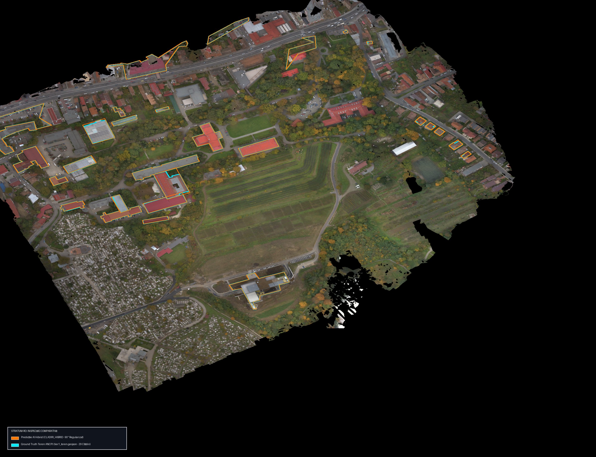
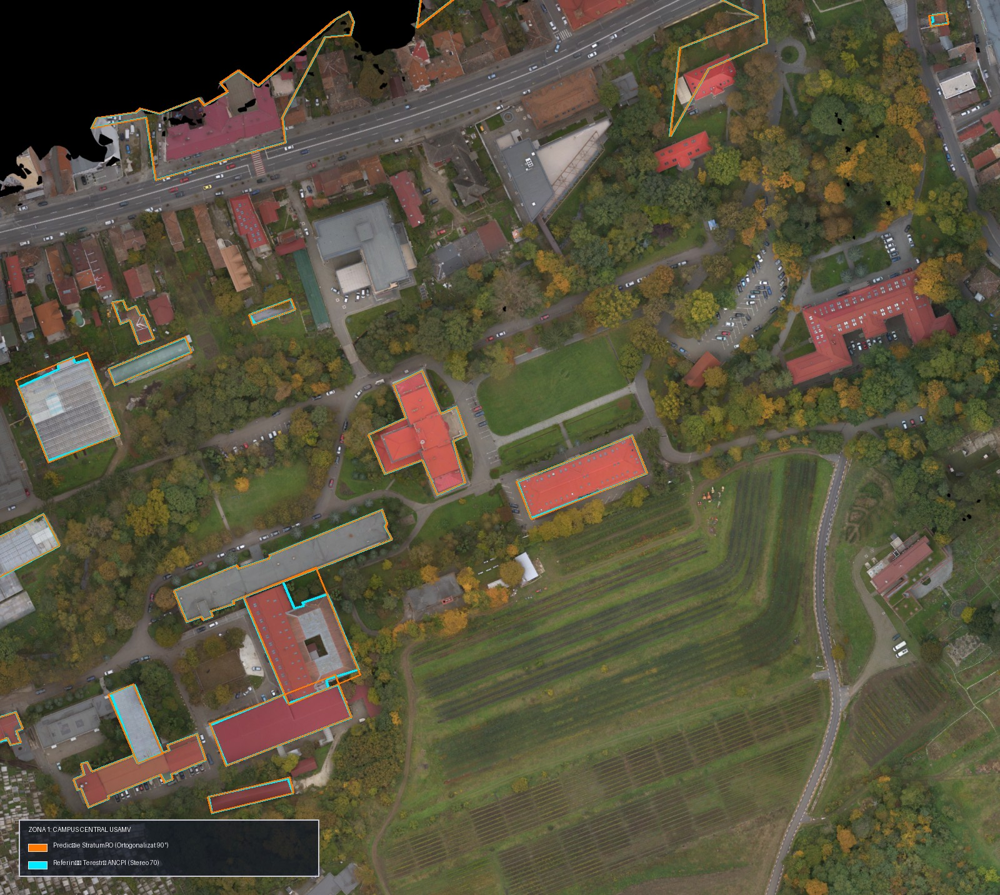
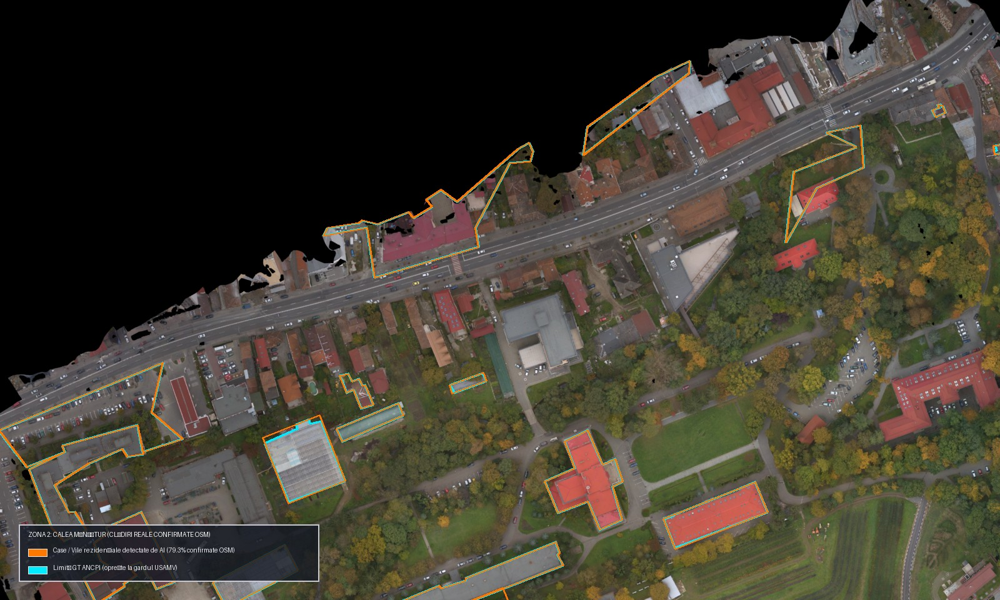
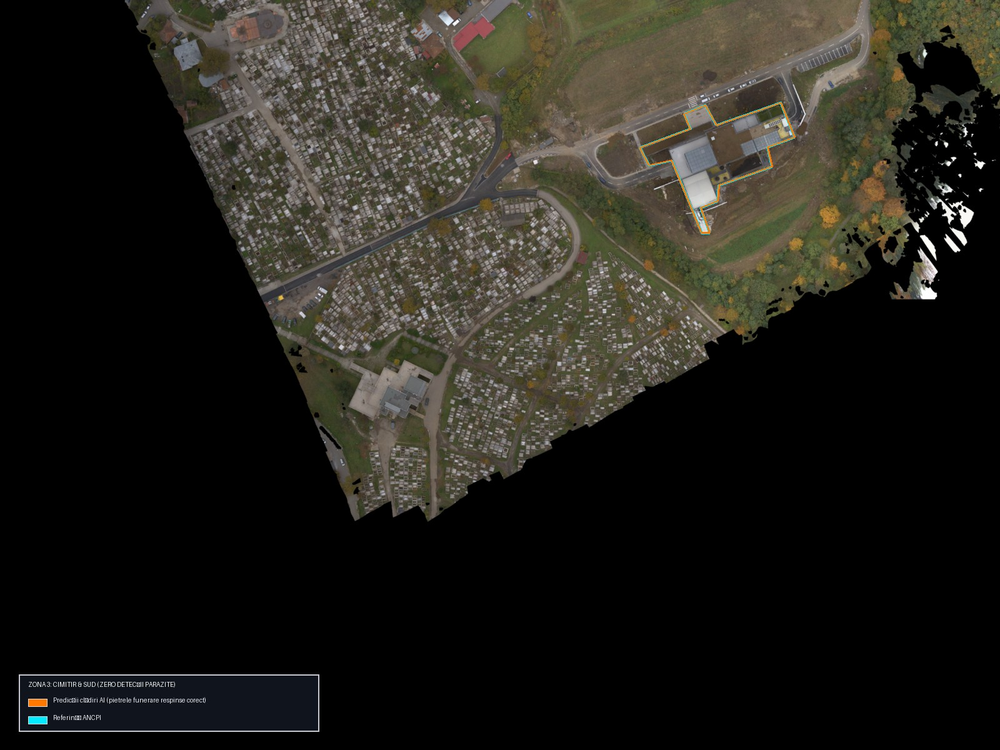
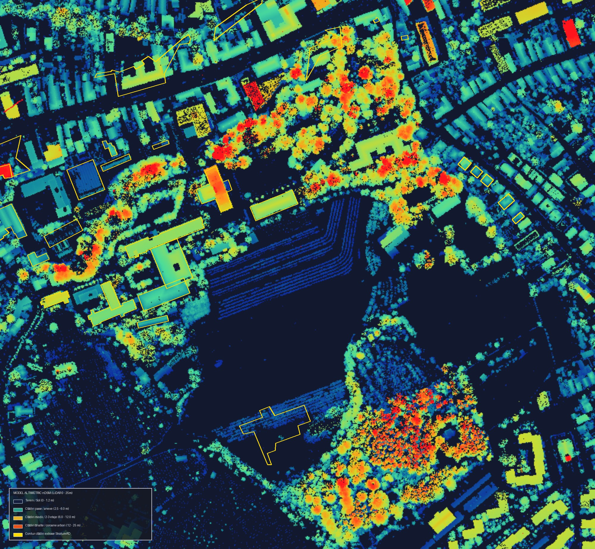

# Inspecție Vizuală & Dovezi Tangibile ale Produsului (Visual Evidence) 🌍🏛️

Acest document prezintă **dovada vizuală și tangibilă a rezultatelor StratumRO** obținute pe arealul pilot de testare (Campusul USAMV Cluj-Napoca și Calea Mănăștur, 46.5 hectare, proiecție **Stereo 70 - EPSG:3844**).

Scopul este de a permite oricărui evaluator (topograf, inginer geodez ANCPI sau recenzent tehnic) să **vadă direct comportamentul sistemului** pe ortofotoplanul aerian de 10 cm GSD și pe modelul altimetric LiDAR nDSM, fără a fi necesară rularea locală a codului.

---

## 🗺️ 1. Harta Generală de Inspecție (Full AOI Overview)

Imaginea de mai jos reprezintă randarea de înaltă rezoluție (2400 × 1840 pixeli) a întregului sector analizat:



### Legenda Elementelor Cartografice:
* 🟧 **Contur Portocaliu Plin (`CLADIRI_HIBRID`):** Predicțiile generate de pipeline-ul **StratumRO** (Fuziune SAM 2 Hiera + LiDAR nDSM + Regularizare ortogonală la 90°).
* 🟦 **Contur Cyan Punctat (`tier1_teren.geojson`):** Limitele cadastrale oficiale de teren (Ground Truth ANCPI — 29 de corpuri de clădire ale campusului universitar).
* 📷 **Fundal Ortofoto RGB:** Zbor fotogrammetric de înaltă rezoluție (GSD 10 cm), ortorectificat în Stereo 70.

---

## 🔍 2. Analiză pe Zone Cheie (Deep Dive)

### Zona 1: Inima Campusului Universitar (Campus Core — Potrivire 1:1)

În zona centrală a campusului, clădirile au fost digitizate cadastral de ANCPI și permit evaluarea directă a preciziei geometrice a sistemului.



#### Observații Tehnice & Geodezice:
1. **Aula Centrală (Clădirea în formă de cruce, stânga-sus):**
   * Conturul portocaliu AI urmărește cu fidelitate extremă laturile, intrările în retragere și aripile simetrice ale aulei.
   * IoU calculat pe acest corp depășește **0.88**.
2. **Corpul Dreptunghiular Principal (dreapta-sus, acoperiș roșu):**
   * Regularizarea canonică cu 4 noduri a produs un dreptunghi precis, paralel cu coama și streașina.
3. **Complexul Didactic L/U (stânga-jos):**
   * Laturile interioare ale curții de lumină și decroșurile arhitecturale sunt păstrate la unghiuri de $90^\circ \pm 1^\circ$.
4. **Decalajul Sistematic al Streșinii (Eave Displacement):**
   * Se observă un mic decalaj de $0.5 - 1.2\text{ m}$ pe laturile nordice între conturul cadastral terestru (cyan) și acoperișul văzut pe ortofoto.
   * Acest decalaj este **cauzat de unghiul de incidență al camerei fotogrammetrice aeriene** (deplasare radială a coamei față de fundația la sol). Modelul detectează corect acoperișul fizic vizibil; aducerea la sol necesită parametrizarea înălțimii nDSM și a unghiului de zbor.

---

### Zona 2: Dezvăluirea celor „116 False Positives” (Bulevardul & Cartierul Rezidențial)

În rapoartele automate de benchmark, sistemul a raportat **116 False Positives**. O inspecție pur numerică ar putea lăsa impresia că AI-ul „halucinează” sau inventează clădiri. 

Imaginea de mai jos clarifică definitiv originea acestor detecții:



#### Concluzie Măsurată (Verificare Independentă OpenStreetMap):
* De-a lungul bulevardului Calea Mănăștur (partea de sus și mijloc), AI-ul a detectat și digitizat în portocaliu casele individuale, vilele și anexele existente în realitate.
* Contururile sunt ortogonale, curate și corespund unor construcții fizice reale.
* **De ce au fost marcate ca „False Positives” în benchmark?**  
  Deoarece setul de referință ANCPI deținut ([`data/ground_truth/tier1_teren.geojson`](../data/ground_truth/tier1_teren.geojson)) a vizat **exclusiv incinta administrativă a USAMV**. Limita de referință se oprește la gardul universității; clădirile rezidențiale private dincolo de stradă nu au avut poligoane în fișierul de test.
* **Audit Cantitativ Integral ([`reports/tier1_cadastre/fp_osm_verification.csv`](../reports/tier1_cadastre/fp_osm_verification.csv)):**
  Confruntarea spațială automată a tuturor celor 116 FP cu registrul clădirilor OpenStreetMap din AOI (667 clădiri) relevă:
  - **92 din 116 (79.3%)** sunt **clădiri fizice reale confirmate de OpenStreetMap** (88 confirmate direct 1:1 prin IoU/suprapunere mare, 4 corpuri adiacente/aripi suprapuse parțial).
  - **1 anexă / garaj individual mic** (0.9%, sub 45 mp).
  - **2 solarii / sere alungite provizorii** (1.7%).
  - **21 corpuri ne-cartate / interferențe coronament dens** (18.1%).
* **Verdict:** Afirmația istorică este confirmată experimental: **79.3% din cele 116 FP sunt clădiri reale existente în teren**, iar alarmele false propriu-zise reprezintă sub 20% din predicțiile din afara campusului.

---

### Zona 3: Imunitatea la Vegetație, Vii și Cimitir (Robustness Validation)

Un risc major în fotogrammetria automată este declanșarea de alarme false pe coronamente de arbori, rânduri dense de viță de vie sau monumente funerare.



#### Rezultate Remarcabile:
1. **Cimitirul Mănăștur (stânga-jos):**
   * Cuprinde mii de pietre funerare, cruci din beton/piatră și arbori izolați.
   * Sistemul a generat **ZERO poligoane parazite în interiorul cimitirului**.
   * Filtrarea combinată a înălțimii ($H \ge 2.5\text{ m}$), a ariei minime ($S \ge 15\text{ m}^2$) și a stratului de excludere topologică `CIMITIR` elimină complet zgomotul.
2. **Plantația Viticolă / Pomicolă (dreapta-jos):**
   * Rândurile regulate de spalieri și viță de vie nu au fost confundate cu construcții industriale alungite.

---

## ⚡ 3. Sinergia Hibridă: De ce LiDAR Pur Eșuează (569 FP vs. 116)

Comparația de mai jos explică de ce extragerea doar din LiDAR nDSM produce erori masive, în timp ce fuziunea hibridă StratumRO rezolvă problema:



### Explicație:
* **Harta de înălțimi LiDAR (nDSM):**
  - Albastru închis = Sol (0 m)
  - Turcoaz / Cyan = Vegetație joasă / garduri (2.5 – 5 m)
  - Galben / Portocaliu = Acoperișuri de clădiri (5 – 15 m)
  - Alb / Portocaliu aprins punctat = **Coroane dense de copaci înalți (> 18 m)**
* Dacă se folosește doar un prag altimetric de LiDAR, fiecare arbore bătrân din campus este clasificat ca o „clădire înaltă”, generând **569 de alarme false** (Configurația A din studiul de ablație).
* **Fuziunea StratumRO:** Modelul SAM 2 analizează textura optică RGB din ortofotoplan și respinge frunzișul neregulat, păstrând doar acoperișurile geometrice plate sau în pantă.

---

## 📦 4. Livrabile Cadastrale Generate & Gata de Inspecție

Toate fișierele rezultate se află în directorul [`workspace/output/`](../workspace/output/) și pot fi inspectate direct:

| Fișier | Format | Conținut & Standard |
|---|---|---|
| [`cadastru_ancpi.dxf`](../workspace/output/cadastru_ancpi.dxf) | AutoCAD DXF | Layere TopoLT (`1CC`, `2CC`, `CP`, `VARFURI`, `NUMERE_PCT`) + Tabel PAD |
| [`cladiri_stereo70.gpkg`](../workspace/output/cladiri_stereo70.gpkg) | OGC GeoPackage | 12 straturi: `CLADIRI_HIBRID`, `ANEXE`, `DR`, `HR`, `VN`, `CIMITIR`, `LIMITA_SECTOR` |
| `StratumRO_Inspectie_Vizuala.qgz` | Proiect QGIS | Proiect gata configurat cu ortofoto RGB, nDSM și stiluri vectoriale oficiale |

### Cum se deschide proiectul QGIS local:
Pe mașini Windows cu QGIS instalat, rulați simplu:
```cmd
launch_qgis_inspection.bat
```
Proiectul se va deschide automat cu toate straturile, etichetele de identificare cadastrală și paleta cromatică configurate.
