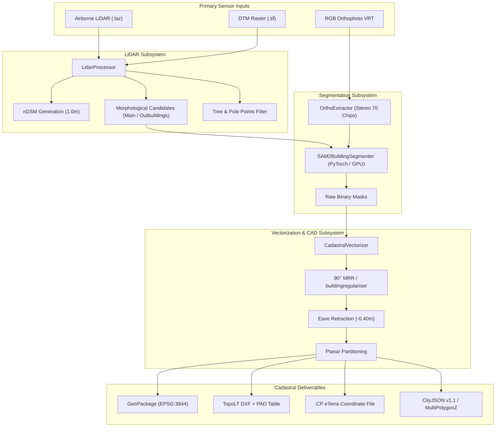

# CURRENT_ARCHITECTURE.md — StratumRO Architecture Audit & Source of Truth

> **Date:** September 2026  
> **Repository:** `lefterpatrickandrei-sketch/StratumRO-QGIS`  
> **Status:** AUDIT COMPLETED — BASELINE VERIFIED  
> **Compliance:** ANCPI Ordinul nr. 600/2023, MDLPA Ordinul nr. 904/2023  
> **Evidence Standard:** AGENTS.md 8 Scientific Rules

---

## 1. Executive Summary

StratumRO is an industrial geomatics and MLOps platform developed for automated building footprint extraction, 90-degree orthogonal regularization, 3D volumetric extrusion, and planar partitioning in Romania's official projection **Stereo 70 (EPSG:3844)** and vertical datum **Marea Neagră 1975 (EPSG:5781)**.

The system is transitioning from a hybrid QGIS plugin with prototype external calls to an **Antigravity-Centered Multi-Agent Architecture**, where:
- **Antigravity** serves as the permanent AI Control Plane and orchestrator.
- **StratumRO** remains the authoritative, deterministic geospatial domain engine.
- **AI models** (OpenAI, Claude, Gemini, NVIDIA NIM, Ollama) serve as interchangeable, provider-independent reasoning and vision specialists.
- **MCP (Model Context Protocol)** serves as the tool interface and communication contract.

---

## 2. Inventory of Existing Subsystems & Components

### 2.1 Domain Geospatial Engines (`stratum_ro/`)
* **`lidar_processor.py`** [IMPLEMENTED & TESTED]:
  - Ingestion of point clouds (`.laz`/`.las`) using `laspy`.
  - Grid generation: DTM, DSM, and normalized Digital Surface Model (nDSM) via morphological filtering.
  - Multi-category semantic point separation: Main buildings ($\ge 2.5\text{ m}$), Outbuildings ($\ge 1.5\text{ m}$), Trees ($\ge 3.8\text{ m}$), Poles/Towers ($\ge 8.0\text{ m}$).
* **`ortho_extractor.py`** [IMPLEMENTED & TESTED]:
  - Orthophoto chip extraction via GDAL / rasterio VRT / TIFF using bounding boxes in Stereo 70 coordinates.
* **`sam2_engine.py`** [IMPLEMENTED & TESTED]:
  - Meta SAM2 Hiera PyTorch predictor with automatic device detection (`cuda`, `cpu`).
  - Candidate-guided prompt generation: passes LiDAR-derived centroids and bounding boxes to SAM2 to generate high-resolution binary masks.
* **`vectorizer.py`** [IMPLEMENTED & TESTED]:
  - 5-stage vectorization pipeline:
    1. Raw mask polygonization (`rasterio.features.shapes`).
    2. Morphological cleanup and Douglas-Peucker simplification.
    3. 90° Orthogonal Regularization: Canonical Minimum Rotated Rectangle (MRR 4-vertex) fitting for simple rectangular structures ($IoU \ge 0.70$) and `buildingregulariser` for complex L/U/T structures.
    4. LiDAR elevation constraint and eave retraction offset ($-0.40\text{ m}$) producing ground footprint (`CLADIRI_SOL_ANCPI`).
    5. Planar partitioning, overlap resolution, and Cadastral Sector boundary clipping (`LIMITA_SECTOR_CADASTRAL`).
* **`cad_exporter.py`** [IMPLEMENTED & TESTED]:
  - TopoLT CAD layer compliance (`1CC`, `2CC`, `CP`, `VARFURI`, `NUMERE_PCT`).
  - Automated PAD coordinate table generation (Plan de Amplasament și Delimitare conform Ordinul 600/2023).
  - `.CP` coordinate interchange file export for ANCPI eTerra.
* **`volumetric_3d.py`** [IMPLEMENTED & TESTED]:
  - LoD1 solid shell 3D extrusion (`MultiPolygonZ` stored in GeoPackage).
  - RANSAC 3D plane fitting for roof inclination estimation.
  - OGC CityJSON v1.1 export.
* **`landuse_ancpi.py`** [IMPLEMENTED & TESTED]:
  - Classification codes according to ANCPI standards: `DR` (roads), `HR` (waterways), `VN` (vineyards), `CIMITIR` (cemeteries/courtyards), `A` (arable land), `UNCLASSIFIED` (planar partition fill).
* **`onnx_engine.py`** [IMPLEMENTED (SKELETON) & TESTED]:
  - Cross-platform ONNX Runtime wrapper supporting `DmlExecutionProvider` (Windows DirectX 12) and `CPUExecutionProvider`.

### 2.2 QGIS Desktop & Processing Framework Integration
* **`stratum_ro.py`**: Standard QGIS plugin entry point managing GUI lifecycle.
* **`stratum_ro_dockwidget.py`**: PyQt5 DockWidget with `SegmentationWorker` (QThread) for asynchronous background processing, AOI map canvas extent selector (`QgsMapToolExtent`), and layer symbology styling.
* **`processing_provider.py` & `cadastral_algorithm.py`**: Native QGIS Processing Framework provider (`StratumROProvider`) and algorithm (`StratumROCadastralAlgorithm`) enabling headless and batch workflows.
* **`create_hybrid_qgis_project.py`**: Standalone generator for `StratumRO_Rezultate.qgz`/`.qgs` with ANCPI layer hierarchy, predefined symbologies, and 3D terrain canvas settings.

### 2.3 Existing AI & Orchestration Components
* **`stratum_ro/orchestrator.py`**:
  - Contains `request_segmentation_plan(siruta_code, project_name, chain)`.
  - Uses `DEFAULT_FALLBACK_CHAIN` targeting NVIDIA NIM models (`meta/llama-3.3-70b-instruct`, `nemotron-4-340b`, `meta-llama/llama-3.1-8b-instruct`) using the `OpenAI` client pointing to `https://integrate.api.nvidia.com/v1`.
  - Implements guaranteed local mock fallback (`get_mock_segmentation_plan()`).
* **`stratum_ro/logic_handler.py`**:
  - `extract_json_from_llm()` for robust JSON extraction from LLM completion text.
  - `StratumOrchestrator` payload validator verifying Stereo 70 CRS (`EPSG:3844` or `EPSG:31700`) and SIRUTA codes.
* **`tools/test_llm_orchestrator.py`**: Standalone test utility evaluating NVIDIA NIM endpoints with JSON function-calling schema.

### 2.4 Existing MCP (Model Context Protocol) Implementation
* **`mcp/filesystem/server.py`**:
  - FastMCP server exposing `create_folder` and `list_files`.
  - Strict security sandbox: paths are validated via `_safe_resolve()` and strictly confined to `workspace/`.
* **`mcp/dataset_manager/server.py`**:
  - FastMCP server exposing `download_geospatial_data(url, filename, layer_type)`.
  - Implements streaming download and structural file format validation (`validator.py`, `downloader.py`, `models.py`).
* **`.aider.mcp.json`**: MCP server registration for local agents.

### 2.5 Evaluation, Benchmarking & Ground Truth (`engine/` & `data/`)
* **`engine/evaluation.py`**: Geodetic validation engine computing IoU, 95% Hausdorff Distance, Boundary RMSE, Centroid Shift, PASCAL/COCO matching, and Wilson score confidence intervals.
* **`engine/ablation_study.py`**: 5-configuration ablation study (Configs A through E) quantifying incremental accuracy gains.
* **`data/ground_truth/tier1_teren.geojson`**: 29 official cadastral buildings in Stereo 70 surveyed and digitized as reference ground truth.

---

## 3. Data Flow Architecture

---

## 4. Current Test Suite Baseline

* **Command:** `venv\Scripts\python -m unittest discover stratum_ro/test`
* **Status:** PASS (Exit Code 0)
* **Execution Metrics:**
  - **Total Tests:** 55
  - **Passed:** 47
  - **Skipped:** 8 (due to headless test environment lacking GUI display or specific optional hardware)
  - **Failed:** 0
  - **Errors:** 0
  - **Runtime:** 5.909 seconds
