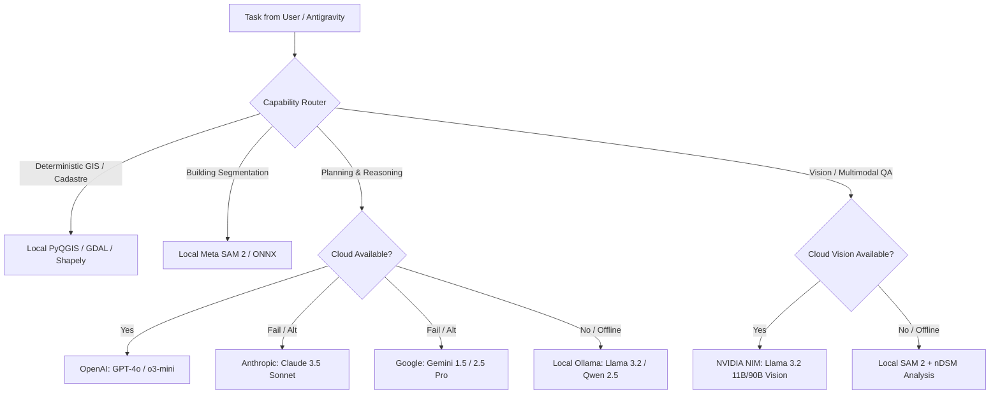

# MODEL_PROVIDER_MAP.md — Capability-Based AI Provider Architecture

> **Architecture:** Decoupled Model Abstraction Layer  
> **Rule:** StratumRO survives provider outages, API deprecations, and network cuts  
> **Key Principle:** Deterministic GIS math stays in Python/C++; LLMs do planning, synthesis & diagnosis

---

## 1. Provider Independence & Fallback Tiers

StratumRO is designed so that no single external AI provider is mandatory. If OpenAI is unreachable, Claude or Gemini takes over. If cloud services or the internet are cut, local Ollama and local PyTorch/ONNX models handle execution.

---

## 2. Model & Provider Catalog

| Provider | Integration Type | Models Supported | Current Status | Required Credentials / URL | Primary Purpose |
| :--- | :--- | :--- | :--- | :--- | :--- |
| **OpenRouter / Kilo** | Remote REST API (OpenRouter) | `meta-llama/llama-3.3-70b-instruct` `meta-llama/llama-3.1-8b-instruct` | **TESTED & OPERATIONAL (722ms)** | `OPENROUTER_API_KEY` (Present in `.env`) URL: `https://openrouter.ai/api/v1` | Kilo adversarial audit, repository-level reasoning, cadastral code review |
| **NVIDIA NIM** | Remote REST API (OpenAI client) | `meta/llama-3.2-11b-vision-instruct` `meta/llama-3.2-90b-vision-instruct` | **TESTED & OPERATIONAL (652ms)** | `NVIDIA_API_KEY` (Present in `.env`) URL: `https://integrate.api.nvidia.com/v1` | Multimodal vision QA (verified with image payload), high-throughput inference |
| **OpenAI** | Remote REST API (`openai` SDK) | `gpt-4o` `gpt-4o-mini` `o3-mini` | **NOT_CONFIGURED** | `OPENAI_API_KEY` (Key missing from `.env`) | Direct OpenAI API access |
| **Anthropic** | Remote REST API (`httpx` / `anthropic`) | `claude-3-5-sonnet` `claude-3-7-sonnet` | **PLANNED / OPTIONAL** | `ANTHROPIC_API_KEY` | Architectural reviews, code audits, adversarial validation |
| **Google Gemini** | Antigravity Control Plane / REST | `gemini-1.5-pro` `gemini-2.5-pro` | **NATIVE IN AGY** | Built into Antigravity IDE | Control plane orchestration, workspace planning |
| **Ollama** | Local REST HTTP | `qwen2.5-coder:7b` `qwen3:8b` (Installed) | **UNAVAILABLE (DAEMON OFFLINE)** | `http://localhost:11434` (Zero cost) | 100% offline fallback, private cadastral data processing |
| **Local SAM 2** | Local PyTorch Engine (`torch` CUDA) | `sam2_hiera_tiny.pt` (155.9 MB) | **BENCHMARKED (CUDA GPU)** | Weights in `models/sam2/` | High-resolution building boundary segmentation |
| **ONNX Runtime** | DirectML / CPU (`onnxruntime`) | `sam2_encoder.onnx` `sam2_decoder.onnx` | **LOADED ON DISK** | Weights in `models/sam2/` | Lightweight cross-vendor local inference |
| **Local Mock** | Deterministic Python Engine | `deterministic-planner-v1` | **TESTED & OPERATIONAL (0.0ms)** | Built-in Python class | Air-gapped fallback, deterministic Stereo 70 plan generation |

---

## 3. Capability-Based Task Routing Matrix

The orchestrator selects tools and providers based on task characteristics, security requirements, and available hardware:

| Task Type | First Choice Provider | Second Choice Fallback | Offline / Air-Gapped Fallback | LLM Ingestion Permitted? |
| :--- | :--- | :--- | :--- | :--- |
| **Polygon Area / Perimeter** | Deterministic (Shapely / PyQGIS) | *None needed* | Deterministic | **NO (Strictly Forbidden)** |
| **CRS Reprojection (Stereo 70)** | GDAL / OGR / QgsCoordinateTransform | *None needed* | Deterministic | **NO (Strictly Forbidden)** |
| **Topology Validation** | Shapely `is_valid` + `explain_validity` | *None needed* | Deterministic | **NO (Strictly Forbidden)** |
| **nDSM Elevation Profile** | `LidarProcessor` (`laspy` + `scipy`) | *None needed* | Deterministic | **NO (Strictly Forbidden)** |
| **Building Optical Segmentation** | Local SAM 2 (PyTorch GPU) | Local ONNX DirectML | Local SAM 2 CPU | Mask weights only |
| **AOI Work Plan Decomposition** | Union Alpha / OpenAI `gpt-4o` | Claude 3.5 Sonnet / Gemini | Ollama `llama3.2` | High-level metadata only |
| **Complex Multi-File Debugging & Failure Diagnosis** | Union Alpha (`stealth/union-alpha`) | OpenAI `gpt-4o` / Claude | Local / Deterministic | Diagnostic logs only |
| **Segmentation Anomaly Diagnosis** | NVIDIA NIM Vision / Union Alpha | OpenAI `gpt-4o` / Claude | Ollama + nDSM Stats | Thumbnail chip + Stats |
| **TopoLT CAD / PAD Generation** | Deterministic `CadastralDxfExporter` | *None needed* | Deterministic | **NO (Strictly Forbidden)** |

---

## 4. Cost, Privacy & Latency Guardrails

1. **Deterministic-First:** If an operation can be solved by linear algebra, spatial indexing (R-Tree), or exact geodetic transformation (EPSG:3844), **zero tokens are consumed**.
2. **Data Minimization:** Cadastral personal identifiers or legal property numbers are never transmitted to external cloud APIs. Only anonymous geometric bounding boxes and normalized raster chips are sent when vision models are explicitly queried.
3. **Graceful Degradation:** When an API key is missing or quota is exhausted, the system logs a `PROVIDER_UNAVAILABLE` event and automatically executes via local mock or Ollama without throwing fatal errors.
