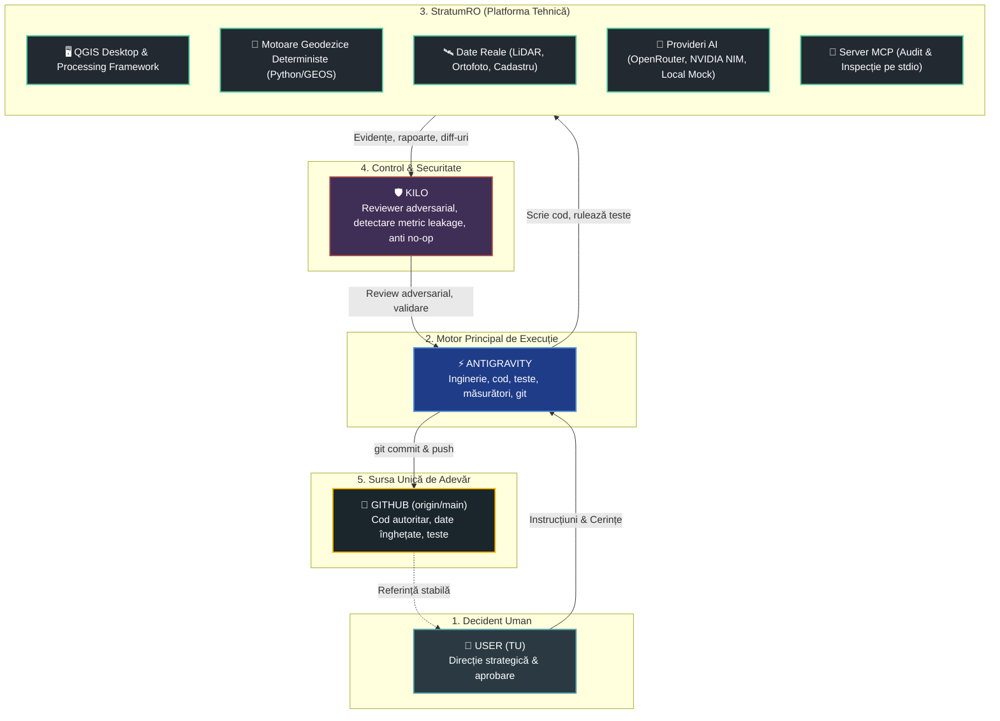
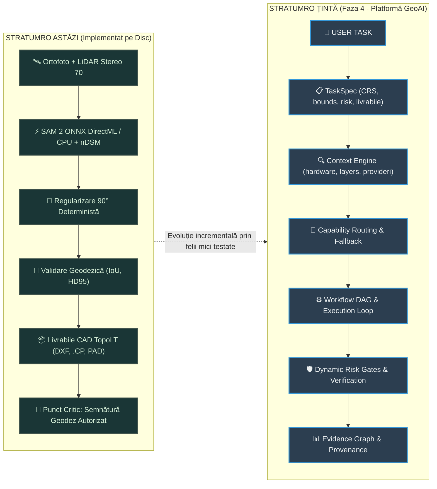
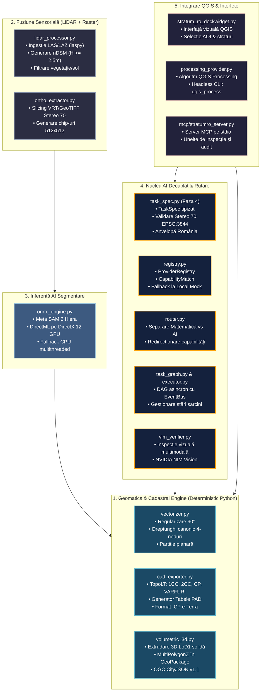
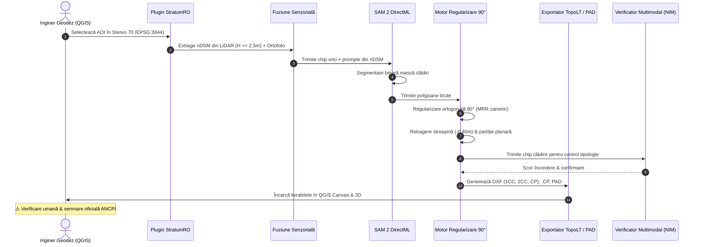
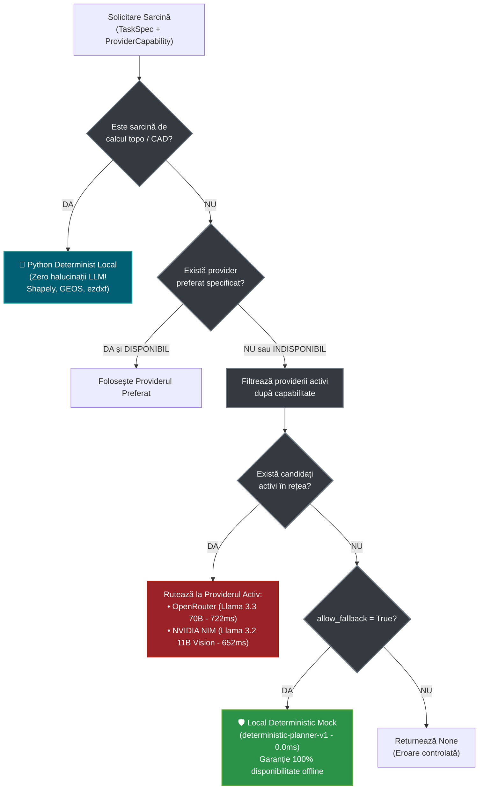

# StratumRO — Harta Vizuală de Arhitectură și Sistem 🗺️📐

**Versiune:** 1.0 (Post-Sincronizare Arhitecturală 2026-09-19)  
**Standard de Guvernanță:** `AGENTS.md` (Cele 8 Reguli Științifice bazate pe Evidențe)  
**Stare Teste:** 193 teste unitare descoperite (184 trecute, 9 omise, 0 eșuate)  

---

## 1. 👥 Harta Actorilor și a Fluxului de Lucru Activ

Acesta este singurul flux operațional aprobat pentru dezvoltarea și auditarea StratumRO:

> [!NOTE]
> **Claude Desktop** este **RETRAS** din fluxul activ (feedback-ul anterior este doar istoric).

---

## 2. 🧠 Modelul Mental Dual: Astăzi vs. Ținta Faza 4

Separarea fundamentală dintre realitatea implementată pe disc și specificația arhitecturală țintă:

---

## 3. 🏛️ Harta Componentelor Tehnice pe Disc

Structura celor 5 subsisteme majore din repository:

---

## 4. 🔄 Pipeline-ul Cadastral Detaliat: De la Senzor la Livrabil

---

## 5. 🤖 Matricea Providerilor AI și Ierarhia de Fallback

Cum rezolvă `ProviderRegistry.resolve_provider()` fiecare solicitare:

---

## 6. 🛑 Liniile Roșii și Regulile de Siguranță Geodezică

| Domeniu | Regula Absolută StratumRO | Motivul Tehnic / Legal |
| :--- | :--- | :--- |
| **Coordonate Stereo 70** | **Strict Python Determinist Local** | Niciun LLM nu are voie să inventeze sau să aproximeze coordonate geodezice ($X, Y, Z$) sau tabele PAD. |
| **Statut Legal Cadastral** | **Pre-Cadastru Asistat (Human-in-the-Loop)** | Generarea fișierelor DXF / .CP nu constituie intabulare autonomă; semnătura geodezului autorizat ANCPI este legal obligatorie. |
| **Limita de Recall Phase 3** | **Raportare transparentă (6.15%)** | Nu se ascund limitele reale (4 TP din 65 referințe); sistemul accelerează digitalizarea, nu garantează perfecțiunea automată. |
| **Poarta de Testare** | **193 Teste Unitare (184 Passed, 0 Failed)** | Nicio modificare de cod nu este acceptată fără rularea suitei complete și raportarea exactă a stării. |
| **Integritate Date** | **Ground Truth Înghețat** | Fișierele `tier1_teren.geojson` și predicțiile benchmark sunt read-only; zero contaminare a datelor de test. |
