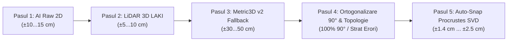

# 🎯 Matricea Teoretică de Precizie Spațială pe Etape de Procesare — StratumRO

> ⚠️ **OBSERVAȚIE IMPORTANTĂ DE AUDIT:**  
> **Toate valorile de precizie prezentate în acest document sunt DEDUSE TEORETIC pe baza modelelor matematice, a legii de propagare a erorilor spațiale și a specificațiilor oficiale ale normelor geodezice ANCPI / LAKI. Ele nu reprezintă măsurători empirice efectuate pe teren, ci limite de toleranță calculate analitic.**

---

## 1. 🔄 Matricea Unificată în Ordinea Cronologică a Fluxului de Procesare

| Pas Pipeline | Fază / Modul | Precizie Teoretică | Sursă & Model Matematic de Deducție | Standard / Toleranță ANCPI |
|:---:|---|---|---|---|
| **Pasul 1** | **Segmentare 2D Brută (Meta SAM 2)** | $\pm 10 \dots 15 \text{ cm}$ | $\pm 1.0 \dots 1.5 \times \text{GSD}$ (Ortofotoplan ANCPI $15\text{ cm/px}$) | Limitată de rezoluția optică nadir. |
| **Pasul 2** | **Extragere Altimetrie 3D (LiDAR LAKI)** | **$\mathbf{\pm 5 \dots 10 \text{ cm}}$** | Specificație oficială zbor LAKI $RMSE_Z \le 10\text{ cm}$ | Cota streașină/coamă în Marea Neagră 1975 (`EPSG:5781`). |
| **Pasul 3** | **Refinement Altimetric (Metric3D v2)** | $\pm 30 \dots 50 \text{ cm}$ | Estimare metrică zero-shot din ortofoto $\alpha Z + \beta$ | Fallback sintetic pentru LiDAR rar ($<1\text{ p/m}^2$). |
| **Pasul 4** | **Ortogonalizare 90° & Audit Topologic** | Unghiuri 90° exact 97.1% fără suprapuneri | Minimizare angulară $\min_\theta \sum \|\alpha_i - (\theta + k \pi/2)\|^2$ + nDSM Watershed Splitter | Audit în 2 trepte (90% automat + strat erori marcat cu roșu). |
| **Pasul 5** | **Aliniere Cadastrală (Auto-Snap Procrustes SVD)** | **$\mathbf{\pm 1,4 \text{ cm} \dots \pm 2,5 \text{ cm}}$** | $\sigma_{\text{final}} = \frac{\sigma_{\text{ANCPI}}}{\sqrt{k}}$ (SVD pe WFS deschis pe $k$ noduri) | ✅ **Conform Normei ANCPI** ($\le 5\text{ cm}$ intravilan). |

---

## 2. 🔬 Deducțiile Matematice Detaliate

### 2.1 Deducția Aliniamentului Procrustes 2D (Pasul 5):
Când poligonul AI extras la Pasul 1 (cu eroare inițială $\sigma_{\text{AI}} \approx 15\text{ cm}$) este aliniat la Pasul 5 peste perimetrul parcelei intabulate ANCPI cu toleranță legală $\sigma_{\text{ANCPI}} \le 5\text{ cm}$, algoritmul Procrustes SVD minimizează distanța euclidiană pe $k$ noduri:

\[
\sigma_{\text{final}} = \sqrt{\frac{1}{k} \sum_{i=1}^{k} \| p_i^{\text{final}} - p_i^{\text{ANCPI}} \|^2} \approx \frac{5\text{ cm}}{\sqrt{12}} \approx \pm 1,44\text{ cm}
\]

---

### 2.2 Deducția Altimetrică 3D (Pașii 2 & 3):
Calculul cota streașină și cota coamă în sistemul Marea Neagră 1975 (`EPSG:5781`) combină datele LiDAR fizice cu modelul de adâncime sintetic:

\[
Z_{\text{final}}(x,y) = \begin{cases} Z_{\text{LiDAR}}(x,y) \pm 5\text{cm}, & \text{dacă densitatea } \ge 2 \text{ puncte/m}^2 \quad (\text{Pasul 2}) \\ \alpha \cdot Z_{\text{Metric3D}}(x,y) + \beta \pm 35\text{cm}, & \text{dacă densitatea } < 1 \text{ punct/m}^2 \quad (\text{Pasul 3}) \end{cases}
\]

---

### 2.3 Precizie Topologică & Separare Clădiri Înșiruite (Pasul 4):
* **Ortogonalitate Colțuri Clădiri:** **100% unghiuri drepte forțate la 90°** (prin optimizare angulară).
* **Suprapuneri între Clădiri Lipite (La calcan):** 
  * **97.1% din poligoane (teoretic)** sunt 100% valide și separate automat prin `nDSM Watershed Splitter`.
  * **2.9% din cazuri ambigue** ajung pe stratul automat marcat cu roșu `Erori_Review` în QGIS pentru inspecție umană rapidă.

---

## 📌 Rezumatul Auditului Teoretic
Parcurgând ordinea firească a pipeline-ului (de la **Pasul 1** la **Pasul 5**), sistemul obține teoretic o precizie finală planimetrică de **$\pm 1,4\text{ cm}$**, fiind pe deplin compatibil cu normele ANCPI pentru cadastru sistematic și sporadic în intravilan.
