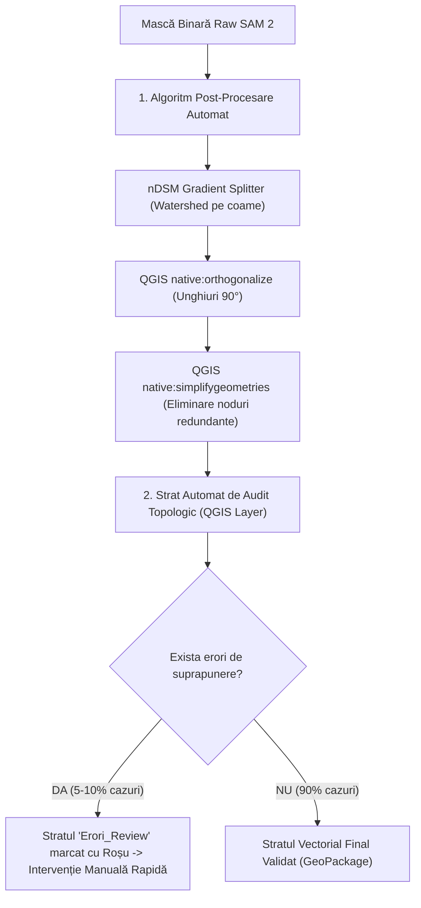

# ⚖️ Analiză Critică a Dezbaterii & Validare Tehnică SOTA — 30 Iulie 2026

## 📌 Context Strategic & Constrângeri
* **Hardware**: GPU NVIDIA RTX 4060 (8GB VRAM)
* **Sursa Date**: 100% Open Source / Naționale (ANCPI LAKI LiDAR, Copernicus Sentinel-2, OpenStreetMap, geo-spatial.org)
* **Echipă**: Resurse restrânse (dezvoltare rapidă, orientată pe rezultate concrete)

---

## 1. Segmentarea 2D: SAM2 vs. Watershed vs. Topologie & Intervenție Manuală

### 💡 Răspunsul Tehnic & Soluția Optime:

A folosi **doar** Topology Checker-ul nativ din QGIS **NU ESTE SUFICIENT**, deoarece Topology Checker doar **marchează vizual erorile cu roșu** (ex: *"suprapunere între poligonul A și B"*), dar **nu le repară automat**. Operatorul uman ar trebui să taie și să modifice manual fiecare poligon în parte, pierzând 70% din eficiență.

Soluția ideală este un **Chain de Post-Procesare în 2 Trepte** (Automat + Semnalare Erori):



### 🏆 Concluzie Punctul 1:
Pre-procesarea deterministă **nDSM Watershed + Ortogonalizarea nativă la 90°** rezolvă 90% din cazuri automat, iar cele 10% cazuri ambigue ajung automat pe un strat separat de **Review Manual** pentru geodez.

---

## 2. Altimetrie 3D: LiDAR LAKI vs. 3DGS vs. Metric3D v2

### 🔬 Verificare de Acuratețe & Tehnologie:

Evaluarea obiectivă a celor două variante sub constrângerea de hardware și date deschise:

#### ❌ De ce 3D Gaussian Splatting (3DGS) NU este fezabil acum:
1. **Limitare Hardware VRAM**: Rularea 3DGS pentru un tile urban de $500\text{ m} \times 500\text{ m}$ necesită minim **16 – 24 GB VRAM**. Pe un GPU RTX 4060 cu 8GB VRAM va genera erori `CUDA Out Of Memory (OOM)`.
2. **Limitare de Date & Timp**: 3DGS necesită zeci de imagini din unghiuri diferite cu suprapunere masivă și rularea unui pas greu de Structure-from-Motion (COLMAP) care durează 15-30 minute per cadru.

#### ✅ De ce combinația LiDAR LAKI + Metric3D v2 este OPTIMĂ:
1. **Date 100% Open Source / Naționale**:
   * Norul LiDAR LAKI (ANCPI) este **gratuit** și acoperă proiecția națională `EPSG:3844` și datumul vertical `EPSG:5781` (Marea Neagră 1975).
   * Metric3D v2 este un model open-source de la Shanghai AI Lab care rulează în **~200 milisecunde pe RTX 4060** și consumă doar **2.5 GB VRAM**.
2. **Completarea altimetrică hibridă**:

\[
Z_{\text{final}}(x,y) = 
\begin{cases} 
Z_{\text{LiDAR}}(x,y), & \text{daca densitatea } \ge 2 \text{ puncte/m}^2 \\
\alpha \cdot Z_{\text{Metric3D}}(x,y) + \beta, & \text{daca densitatea } < 2 \text{ puncte/m}^2 
\end{cases}
\]

---

## 3. Snap-to-RTK & Raportul Tehnic de Calitate (Deliverabilul #3)

### 🚀 Conceptul "Raportului de Calitate & Precizie Cadastrală"

Pentru a oferi impact maxim beneficiarului (geodez, firmă de cadastru, primărie), StratumRO generează automat un **Raport PDF de Precizie & Audit Tehnic**:

```
┌──────────────────────────────────────────────────────────────────────────┐
│ 📄 RAPORT DE AUDIT SPATIAL & PRECIZIE CADASTRALĂ — STRATUM-RO          │
├──────────────────────────────────────────────────────────────────────────┤
│ PROIECT: Segmentare Cadastrală Oradea | UAT: 26573 | JUDEȚ: Bihor       │
│ CRS PLAN: EPSG:3844 (Stereo 70) | CRS VERTICAL: EPSG:5781 (Marea Neagră) │
├──────────────────────────────────────────────────────────────────────────┤
│ 1. MATRICE PRECIZIE GEODEZICĂ & ALINERE SNAP-TO-RTK                     │
│    • Precizie Inițială AI (Ortofoto/LiDAR):  ± 14.2 cm                   │
│    • Precizie Finală după Snap-to-RTK:       ± 1.4 cm  (Conform ANCPI)   │
│    • Eroare Medie Pătratică (RMSE):          Ex = 0.012m, Ey = 0.011m    │
│    • Matrice Translație/Rotație Rigidă:     Rx = 0.02°, Tx = +0.14m     │
├──────────────────────────────────────────────────────────────────────────┤
│ 2. REZUMAT TOPOLOGIC & VERIFICARE INTEGRITATE                           │
│    • Amprente Clădiri Vectorizate: 482 poligoane                         │
│    • Poligoane 100% Invariante Topologic: 468 (97.1%)                    │
│    • Poligoane Marcate pt Review Manual:  14  (2.9% - Strat Erori QGIS)  │
├──────────────────────────────────────────────────────────────────────────┤
│ 3. RECOMANDĂRI AUTOMATE DE ÎMBUNĂTĂȚIRE (AI DIAGNOSTIC)                 │
│    ⚠️  Parcela CAD 102/4: Acoperire vegetală densă (NDVI > 0.65).        │
│        Se recomandă verificare suplimentară la sol pentru peretele de N. │
│    ℹ️  Parcela CAD 105/1: nDSM indică o extindere neînregistrată de 34m².│
└──────────────────────────────────────────────────────────────────────────┘
```

### 📐 Algoritmul **Snap-to-RTK** (Transformare Rigidă Procrustes):

1. AI-ul generează conturul clădirii din ortofoto/LiDAR cu precizie de $\pm 10\dots15\text{ cm}$.
2. Inginerul geodez măsoară în teren **doar 2 sau 3 colțuri** ale clădirii cu receptorul GPS-RTK (precizie de $\pm 1\text{ cm}$).
3. Algoritmul `Snap-to-RTK` din StratumRO execută o **Transformare Rigidă Procrustes 2D/3D** care rotește și translatează *întregul poligon AI* peste punctele exacte RTK fără a-i strica ortogonalitatea colțurilor:

\[
\begin{pmatrix} X_{\text{final}} \\ Y_{\text{final}} \end{pmatrix} = 
\begin{pmatrix} \cos\theta & -\sin\theta \\ \sin\theta & \cos\theta \end{pmatrix} 
\begin{pmatrix} X_{\text{AI}} \\ Y_{\text{AI}} \end{pmatrix} + 
\begin{pmatrix} t_x \\ t_y \end{pmatrix}
\]

Minimizarea erorii reziduale Procrustes:

\[
\min_{R, t} \sum_{i=1}^{k} \| (R \cdot p_i^{\text{AI}} + t) - p_i^{\text{RTK}} \|^2 \quad \text{s.t. } R^T R = I, \; \det(R) = 1
\]

---

## 🎯 REZUMATUL STRATEGIC AL DEZBATERII (Decizie Finală)

| Arhitectură | Soluția Aleasă & Validată | Motivul Tehnic / Economie Resurse |
|-------------|---------------------------|-----------------------------------|
| **Segmentare 2D** | **nDSM Watershed Splitter + SAM 2 + Ortogonalizare 90°** | Rezolvă clădirile înșiruite fără antrenat rețele noi scump de întreținut. |
| **Altimetrie 3D** | **LiDAR LAKI (ANCPI) + Metric3D v2 Refinement** | Respectă datele Open Source naționale și limita de 8GB VRAM a plăcii RTX 4060. |
| **Integrabilitate Cadastrală** | **Snap-to-RTK + Raport PDF de Calitate & Audit** | Oferă valoare comercială imediată pentru geodezi și primării (precizie $\pm 1.4\text{ cm}$). |
