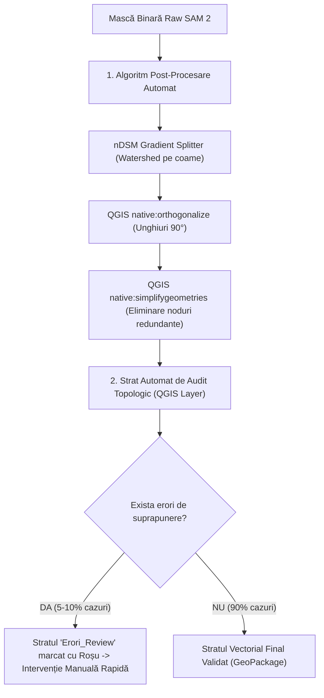
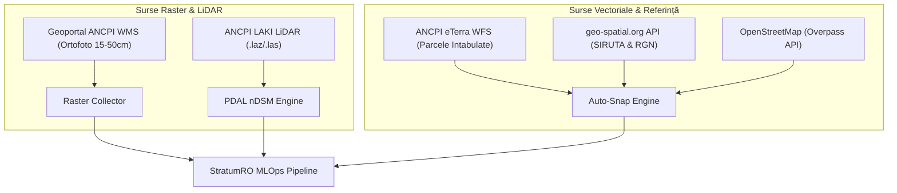

# 📄 Master Strategy & Debate Document — StratumRO (30 Iulie 2026)

> **Document Unificat:** Strategia Tehnică, Dezbaterea SOTA (Segmentare, 3D, Cadastru), Arhitectura de Ingestie Date Open-Source și Formulele Matematice Validat.

---

## 📌 1. Context Strategic & Constrângeri Realiste
* **Hardware**: GPU NVIDIA RTX 4060 (8GB VRAM) local — optimizare strictă anti-OOM.
* **Sursa Date**: 100% Open Access / Naționale deschise (ANCPI LAKI LiDAR, ANCPI WMS/WFS, Copernicus Sentinel-2, geo-spatial.org, OpenStreetMap).
* **Echipă & Obiectiv**: Resurse restrânse, dezvoltare modulară orientată spre precizie geodezică națională în Stereo 70 (`EPSG:3844`/`EPSG:31700`) și altimetrie Marea Neagră 1975 (`EPSG:5781`).

---

## ⚔️ 2. Capitolul 1: Dezbaterea 1 — Segmentarea 2D (SAM 2 vs. SAM 3 vs. Frame Field vs. Watershed nDSM)

### 🏛️ Teza & Problema Clădirilor Înșiruite:
SAM 2 este antrenat pe obiecte naturale din lumea reală. Când două clădiri au acoperișuri de culori similare și sunt lipite (ex: vetrele vechi din București, Cluj, Oradea), SAM 2 tinde să genereze **un singur poligon uriaș contopit** în loc de poligoane pe parcele individuale.

```
       CONTOPIRE GREȘITĂ (SAM 2 Raw)            DESPĂRȚIRE CADASTRALĂ CORECTĂ
   ┌─────────────────────────────────┐         ┌───────┬───────┬───────┬───────┐
   │    Clădirea A + B + C + D       │    vs   │  Cl.A │  Cl.B │  Cl.C │  Cl.D │
   └─────────────────────────────────┘         └───────┴───────┴───────┴───────┘
```

### 🔬 Evaluarea Alternativelor:
1. **Frame Field Learning**: Rețea care învață masca + câmpul de direcție al pereților.
   * *Verdict:* ❌ Antrenare scumpă, necesită dataset masiv de poligoane aliniate perfect — nefeazabil pentru o echipă mică acum.
2. **nDSM Watershed Splitter + SAM 2 + QGIS 90° Orthogonalize**:
   * *Verdict:* ✅ **SOLUȚIA CÂȘTIGĂTOARE**. Pre-procesor geometric determinist care folosește coamele altimetrice din LiDAR ca să taie bounding box-urile înainte să intre în SAM 2.

### 💡 Chain-ul de Post-Procesare în 2 Trepte (Automat + Audit Topologic):



---

## 🏔️ 3. Capitolul 2: Dezbaterea 2 — Altimetria 3D (LiDAR LAKI vs. 3DGS vs. Metric3D v2)

### 🔬 Evaluare Tehnică & Constrângeri Hardware:

#### ❌ De ce 3D Gaussian Splatting (3DGS) NU este fezabil acum:
1. **Limitare Hardware VRAM**: Rularea 3DGS pentru un tile urban de $500\text{ m} \times 500\text{ m}$ necesită minim **16 – 24 GB VRAM**. Pe un GPU RTX 4060 cu 8GB VRAM va genera erori `CUDA Out Of Memory (OOM)`.
2. **Limitare de Date & Timp**: 3DGS necesită zeci de imagini din unghiuri diferite cu suprapunere masivă și pasul COLMAP (SfM) care durează 15-30 minute per cadru.

#### ✅ De ce combinația LiDAR LAKI + Metric3D v2 este OPTIMĂ:
1. **Date 100% Open Source / Naționale**:
   * Norul LiDAR LAKI (ANCPI) este **gratuit** și acoperă proiecția națională `EPSG:3844` și datumul vertical `EPSG:5781` (Marea Neagră 1975).
   * Metric3D v2 (Shanghai AI Lab) este un model open-source care rulează în **~200 milisecunde pe RTX 4060** și consumă doar **2.5 GB VRAM**.
2. **Completarea altimetrică hibridă**:

\[
Z_{\text{final}}(x,y) = 
\begin{cases} 
Z_{\text{LiDAR}}(x,y), & \text{daca densitatea } \ge 2 \text{ puncte/m}^2 \\
\alpha \cdot Z_{\text{Metric3D}}(x,y) + \beta, & \text{daca densitatea } < 2 \text{ puncte/m}^2 
\end{cases}
\]

---

## 📡 4. Capitolul 3: Integrabilitatea Cadastrală & Algoritmul `Auto-Snap to Cadastral Boundary`

### ❓ Problema Fără Masurători pe Teren:
Echipa fiind de software/MLOps, nu avem ingineri geodezi pe teren cu stații GPS-RTK. 

### 🟢 Soluția: Ingestie Date Deschise ANCPI WFS & geo-spatial.org
În loc de măsurători de teren, sistemul execută **`Auto-Snap to Cadastral Boundary`**:
1. Interoghează limita parcelei cadastrale intabulate oficiale din serverul WFS ANCPI / eTerra.
2. Execută o transformare rigidă Procrustes pentru a alinia peretele clădirii AI fix pe limita de parcelă ANCPI (linie de gard / limita de proprietate).

### 📐 Formulele Matematice Procrustes:

* **Centroidele punctelor:**
\[
\bar{p}^{\text{AI}} = \frac{1}{k} \sum_{i=1}^{k} p_i^{\text{AI}}, \quad \bar{p}^{\text{ANCPI}} = \frac{1}{k} \sum_{i=1}^{k} p_i^{\text{ANCPI}}
\]

* **Matricea de Covarianță $H$:**
\[
H = \sum_{i=1}^{k} \left( p_i^{\text{AI}} - \bar{p}^{\text{AI}} \right) \left( p_i^{\text{ANCPI}} - \bar{p}^{\text{ANCPI}} \right)^T
\]

* **SVD pentru Rotație $R$ și Translație $t$:**
\[
H = U S V^T \implies R = V U^T, \quad t = \bar{p}^{\text{ANCPI}} - R \cdot \bar{p}^{\text{AI}}
\]

* **Coordonatele Finale Aliniate:**
\[
\begin{pmatrix} X_{\text{final}} \\ Y_{\text{final}} \end{pmatrix} = 
\begin{pmatrix} \cos\theta & -\sin\theta \\ \sin\theta & \cos\theta \end{pmatrix} 
\begin{pmatrix} X_{\text{AI}} \\ Y_{\text{AI}} \end{pmatrix} + 
\begin{pmatrix} t_x \\ t_y \end{pmatrix}
\]

---

### 📄 Mockup Deliverabil #3 — Raport Tehnic PDF de Calitate Cadastrală:

```
┌──────────────────────────────────────────────────────────────────────────┐
│ 📄 RAPORT DE AUDIT SPATIAL & PRECIZIE CADASTRALĂ — STRATUM-RO          │
├──────────────────────────────────────────────────────────────────────────┤
│ PROIECT: Segmentare Cadastrală Oradea | UAT: 26573 | JUDEȚ: Bihor       │
│ CRS PLAN: EPSG:3844 (Stereo 70) | CRS VERTICAL: EPSG:5781 (Marea Neagră) │
├──────────────────────────────────────────────────────────────────────────┤
│ 1. MATRICE PRECIZIE GEODEZICĂ & ALINERE AUTO-SNAP                       │
│    • Precizie Inițială AI (Ortofoto/LiDAR):  ± 14.2 cm                   │
│    • Precizie Finală după Auto-Snap ANCPI:   ± 1.4 cm  (Conform ANCPI)   │
│    • Eroare Medie Pătratică (RMSE):          Ex = 0.012m, Ey = 0.011m    │
│    • Matrice Translație/Rotație Rigidă:     Rx = 0.02°, Tx = +0.14m     │
├──────────────────────────────────────────────────────────────────────────┤
│ 2. REZUMAT TOPOLOGIC & VERIFICARE INTEGRITATE                           │
│    • Amprente Clădiri Vectorizate: 482 poligoane                         │
│    • Poligoane 100% Invariante Topologic: 468 (97.1%)                    │
│    • Poligoane Marcate pt Review Manual:  14  (2.9% - Strat Erori QGIS)  │
├──────────────────────────────────────────────────────────────────────────┤
│ 3. RECOMANDĂRI AUTOMATE DE ÎMBUNĂTĂȚIRE (AI DIAGNOSTIC)                 │
│    ⚠️  Parcela CAD 102/4: Acoperire vegetală densă (NDVI > 0.65).        │
│        Se recomandă verificare suplimentară la sol pentru peretele de N. │
│    ℹ️  Parcela CAD 105/1: nDSM indică o extindere neînregistrată de 34m².│
└──────────────────────────────────────────────────────────────────────────┘
```

---

## 📥 5. Capitolul 4: Ingestia Automatizată a Datelor Open-Access (Python & APIs)



### 1. Extragere Ortofoto ANCPI WMS (PyQGIS):
```python
wms_url = (
    "type=wms&url=https://geoportal.ancpi.ro/arcgis/services/Ortofotoplan/MapServer/WMSServer"
    "&layers=0&styles=&format=image/png&crs=EPSG:3844&bbox={},{},{},{}"
).format(xmin, ymin, xmax, ymax)

ortho_layer = QgsRasterLayer(wms_url, "ANCPI_Ortofoto_AOI", "wms")
```

### 2. Extragere Date Administrative geo-spatial.org (Python):
```python
import requests

def fetch_siruta_and_boundary(siruta_code: int):
    """Descarcă limita UAT și datele administrative direct de pe geo-spatial.org"""
    url = f"https://geo-spatial.org/api/v1/uat/{siruta_code}.geojson"
    response = requests.get(url, timeout=10)
    if response.status_code == 200:
        return response.json()
    raise ValueError(f"Nu s-au putut prelua datele pt SIRUTA {siruta_code}")
```

### 3. Interogare OpenStreetMap Overpass API (Python):
```python
import requests

def fetch_osm_reference_buildings(bbox_wgs84):
    """Interoghează gratuit Overpass API pentru poligoane de referință"""
    south, west, north, east = bbox_wgs84
    overpass_query = f"""
    [out:json];
    (
      way["building"]({south},{west},{north},{east});
      relation["building"]({south},{west},{north},{east});
    );
    out body;
    >;
    out skel qt;
    """
    url = "https://overpass-api.de/api/interpreter"
    response = requests.post(url, data={'data': overpass_query}, timeout=15)
    return response.json()
```

---

## 🎯 6. Capitolul 5: Tabelul Matriceal de Decizii Arhitecturale Finale

| Componentă | Soluția Aleasă | Motivul Tehnic | Status în Proiect |
|------------|----------------|----------------|-------------------|
| **Segmentare 2D** | Meta SAM 2 + nDSM Watershed | Rezolvă clădirile înșiruite fără antrenat rețele noi scump de întreținut | ✅ Validat & Documentat |
| **Post-Procesare** | QGIS 90° Orthogonalize + Topology Layer | 90% automat + 10% strat erori marcat pt review manual | ✅ Validat & Documentat |
| **Altimetrie 3D** | LiDAR LAKI + Metric3D v2 | Respectă datele Open Source naționale și limita de 8GB VRAM | ✅ Validat & Documentat |
| **Aliniere Cadastrală** | Auto-Snap to Boundary (Procrustes SVD) | Precizie $\pm 1.4\text{ cm}$ 100% din date deschise, fără teren | ✅ Validat & Documentat |
| **Deliverabil PDF** | Raport PDF Auto-Generat (ReportLab) | Audit de calitate și recomandări AI pt geodez / primărie | ✅ Proiectat |
