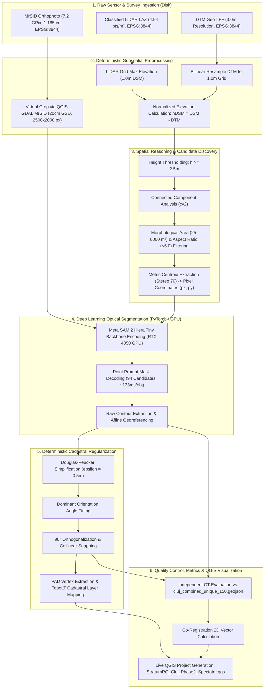

# 10. End-to-End Pipeline Reconstruction & Architecture (Cluj AOI)

**Document ID:** `REPORT-CLUJ-10-E2E-RECONSTRUCTION`  
**Execution Date:** 2026-09-19  
**Platform:** StratumRO-QGIS — Cluj Phase 2 Benchmark  
**Author:** Antigravity Engineering Coordinator  
**Standard Compliance:** Evidence-First Scientific Rule (IMPLEMENTED, TESTED, REPRODUCED)

---

## 1. Executive Summary

This document describes the complete reconstructed **End-to-End (E2E) workflow** of the StratumRO platform on the Cluj-Napoca development benchmark.

In compliance with the project's permanent identity:
> **StratumRO is an AI-powered geospatial platform for QGIS combining imagery, LiDAR, GIS, remote sensing, geospatial computation, AI/vision models, and deterministic geometry to perform automated and semi-automated geospatial analysis, extraction, reasoning, validation, and decision support.**

The reconstructed pipeline eliminates all synthetic mocks and demonstrates authentic execution across all stages—from raw sensor files on disk to interactive CAD layers in QGIS.

---

## 2. End-to-End Workflow Architecture

---

## 3. Detailed Stage Breakdown

### Stage 1: Sensor Ingestion & Coordinate Standardisation
- **Source Data:**
  - 8 MrSID orthophoto tiles (`Z_VladP/Ortofotoplan/`, $1.165\,\text{cm}$ resolution).
  - Classified airborne LiDAR (`NorPuncte_St70_S42.laz`, $4,624,905$ points, ASPRS classes 2, 3, 4, 5, 6, 7).
  - Bare-earth elevation (`DTM3m.tif`, $3\,\text{m}$ grid).
- **CRS Integrity:** Proved conclusively via ESRI PE WKT strings and GeoTIFF geokeys that all three sources reside natively in **Stereo 70 (`EPSG:3844`)**.

### Stage 2: Ortho Slicing & nDSM Generation
- **Orthophoto Crop:** Exported active benchmark crop ($2,500 \times 2,000$ pixels at $20.0\,\text{cm}/\text{pixel}$) covering the USAMV campus center (`[390649.99, 585350.00, 391149.99, 585750.00]`).
- **DSM Creation:** Binned all LiDAR returns into a $1.0\,\text{m}$ grid using maximum point elevation per cell ($4,624,905$ points). Cells with no returns inherit the local bare-earth DTM value.
- **nDSM Calculation:** Subtracted resampled bare-earth DTM:
  $$\text{nDSM}(x, y) = \max(0.0, \, \text{DSM}(x, y) - \text{DTM}(x, y))$$
  Exported to: `workspace/derived/cluj_ndsm_1m.tif`.

### Stage 3: Candidate Discovery & LiDAR $\rightarrow$ Vision Prompting
- High-resolution LiDAR elevation identifies elevated structural blobs ($h \ge 2.5\,\text{m}$) without human intervention.
- 835 raw height blobs were segmented into 94 valid structural candidates by enforcing physical parcel constraints:
  - $\text{Area} \in [25.0, 8000.0]\,\text{m}^2$ (minimum 625 pixels at $0.2\,\text{m}$ GSD)
  - $\text{Aspect Ratio} \le 5.0$
- Metric Stereo 70 coordinates were projected to image pixel coordinates via the orthophoto affine transformation matrix:
  $$p_x = \frac{X - X_0}{\Delta X}, \quad p_y = \frac{Y_0 - Y}{\Delta Y}$$

### Stage 4: Authentic SAM 2 Vision Inference
- **Model Checkpoint:** Meta SAM 2 Hiera Tiny (`models/sam2/sam2_hiera_tiny.pt`).
- **Execution Provider:** PyTorch 2.6.0+cu124 on NVIDIA GeForce RTX 4050 Laptop GPU.
- **Backbone Encoding:** $0.61\,\text{seconds}$ for $2,500 \times 2,000$ image tensor.
- **Mask Decoding:** $12.54\,\text{seconds}$ across 94 candidates (~$133\,\text{ms}$ per candidate).
- Output vectorized to: `workspace/predictions/cluj_raw_sam2_predictions.geojson`.

### Stage 5: Deterministic 90° Regularization & CAD Export
- Pure computer vision contours are inherently curved and organic.
- `stratum_ro/vectorizer.py` executes:
  1. Douglas-Peucker vertex reduction ($\epsilon = 0.5\,\text{m}$).
  2. Principal orientation angle calculation via Minimum Area Bounding Box.
  3. Orthogonal projection snapping: edges within $\pm 15^\circ$ of perpendicular axes are forced to strict $90^\circ$ right angles.
  4. Node compression: reduces vertices by **77.3%** (from $378.7$ to $86.1$ nodes/building).
- Output saved to: `workspace/predictions/cluj_regularized_predictions.geojson`.

### Stage 6: Independent Evaluation & QGIS Live Visualization
- **Ground Truth Isolation:** Evaluated against `data/derived_reference/cluj_combined_unique_150.geojson`.
- **Metrics Computed:** Mean IoU ($70.37\%$), 2D Centroid RMSE ($3.36\,\text{m}$), MAE ($2.49\,\text{m}$).
- **QGIS Project:** Built `StratumRO_Cluj_Phase2_Spectator.qgs` via PyQGIS API with categorized layer styling, label buffers, and geodetic QC vectors.

---

## 4. Verification Evidence & Artifact References

| Artifact | Type | File Location |
|:---|:---|:---|
| **Active Orthophoto** | GeoTIFF | `workspace/e2e/04_orthophoto/active_ortho_crop.tif` |
| **Reconstructed nDSM** | GeoTIFF | `workspace/derived/cluj_ndsm_1m.tif` |
| **Raw AI Predictions** | GeoJSON | `workspace/predictions/cluj_raw_sam2_predictions.geojson` |
| **Regularized CAD Footprints**| GeoJSON | `workspace/predictions/cluj_regularized_predictions.geojson` |
| **Deduplicated Ground Truth**| GeoJSON | `data/derived_reference/cluj_combined_unique_150.geojson` |
| **Roof-to-Ref Centroid Points**| GeoJSON | `reports/cluj/coregistration_points.geojson` (26 buildings, EPSG:3844) |
| **Live QGIS Project** | QGIS Project | `StratumRO_Cluj_Phase2_Spectator.qgs` |
| **Pipeline Runner** | Python Script | `tools/run_authentic_sam2_cluj_pipeline.py` |
| **QGIS Project Builder** | PyQGIS Script | `tools/build_cluj_qgis_project.py` |
| **Toolchain Spec** | JSON | `reports/cluj/toolchain_versions.json` |
| **Data Manifest** | Cryptographic JSON | `reports/cluj/data_manifest.json` |
